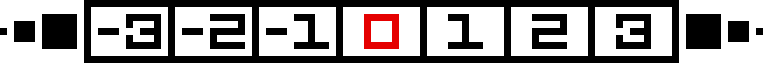
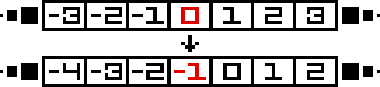
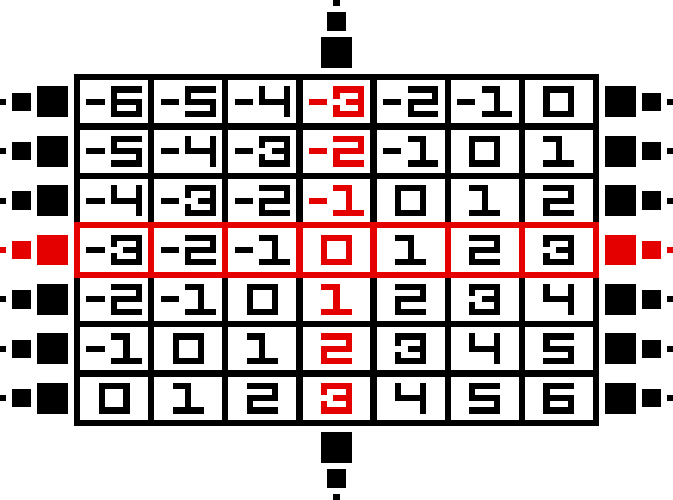

# Комонады

## Концепция комонад

Приставка "ко" в слове, в данном случае, означает *дуальность*. Конкретное определение лежит в основе идеи комонады: давайте вспомним про две основные функции монад `join` и `return`, а именно про их сигнатуры.

```haskell
return :: a -> t a
join   :: t (t a) -> t a
```

А если развернуть стрелки? Мы получаем функцию `extract`, которая вытаскивает `a` из контекста `t` и `duplicate`, которая как бы дублирует контекст.

```haskell
extract   :: t a -> a
duplicate :: t a -> t (t a)
```

Собственно, вот и идея комонад - в этих двух функциях, остаётся что-то сделать с bind. Вспомним про стрелку Клейсли: `(a -> t b)`, где `t` - это как минимум функтор или (обычно) стрелка. Давайте её также развернём: получаем `(t a -> b)` - стрелка Коклейсли, взяли `a` в контексте и преобразовали её в `b`, при этом отбросив контекст. Теперь внимательно посмотрим на функцию bind.

```haskell
bind :: (a -> t b) -> (t a -> t b)
-- в отличии от изначальной сигнатуры, мы здесь поменяли местами первый и второй аргументы,
-- теперь мы можем воспринимать эту функцию, как принимающая функцию `(a -> t b)`
-- и возвращающая функцию трансформации из `(t a -> t b)`
```

Таки давайте мы поменяем стрелку Клейсли на Коклейсли и получим функцию, которую обычно именуют `extend`.

```haskell
extend :: (t a -> b) -> (t a -> t b)
```

В техническом плане, `Comonad` - это `Functor`, потому что раньше в Haskell не было `Applicative`, а нынешний constraint остаётся таким же.

```haskell
class Functor w => Comonad w where
  extract   :: w a -> w
  duplicate :: w a -> w (w a)
  -- заметим, что `duplicate` можно реализовать через `extend`:
  -- `extend id x`
  extend    :: (w a -> b) -> w a -> w b
  -- заметим, что `extend` можно реализовать через `duplicate`:
  -- `fmap f (duplicate x)`
```

У комонады, как и у монады, есть и операторная форма функции `extend`.

```haskell
(=>>) :: Comonad w => w a -> (w a -> b) -> w b
-- выглядит почти как `(>>=)`
(=>>) = flip extend
-- поскольку у `extend` немного изменен порядок аргументов,
-- приходится исправлять через `flip`
```

Пример самой тривиальной комонады - `Identity`.

```haskell
data Identity a = Identity { runIdentity :: a }
-- возвращает саму себя
```

```haskell
instance Comonad Identity where
  extract = runIdentity
  -- мы вытаскиваем из контекста значение
  -- в данном случае - просто используем данную нам функцию

  duplicate = Identity
  -- мы заворачиваем в ещё один контекст
  -- в данном случае - просто запихиваем значение `Identity` как тип `a` в `Identity`
```

Как и у монады есть некоторые правила, с которыми согласны все при использовании комонады. Введем, как и в случае монады, композицию двух комонад, назовем это композицией Коклейсли.

```haskell
(=<=) :: Comonad w => (w b -> c) -> (w a -> b) -> (w a -> c)
g =<= f = \x -> g (x =>> f)
-- здесь: `\x` - это `w a`
--        `x =>> f` - extend `w a` и получение `w b`
-- наконец, полученный `w b` передаём в функцию `g` типа `w b -> c`
```

По правилам - мы получаем ровно те же, но только стрелки разворачиваются и меняются одни функции на другие.

* В терминах `(=<=)`.
  1. Ассоциативность.

      ```haskell
      (h =<= g) =<= f === h =<= (g =<= f)
      ```

  2. Тождество.

      ```haskell
      extract =<= f === f
      f =<= extract === f
      ```

* В терминах `(=>>)` - левоассоциативная функция, как bind.
  1. Ассоциативность.

      ```haskell
      w =>> f =>> g === w =>> (\x -> g (x =>> f))
      ```

  2. Тождество.

      ```haskell
      extract (x =>> f) === f x
      -- `extract` от `extend` - это `extend`
      -- или: применение к `x`

      w =>> extract     === w
      -- передача в `w` в `extract` никак не меняет результат
      ```

В чем принципиальная разница между монадой и комонадой, кроме повернутых стрелок? Монады обычно нужны для вычислений с выходом *эффектов от вычислений*. Комонады же - вычисляются в *контекстно-зависимые вычисления*.

## The List Zipper

**List Zipper** - это структура данных, оперирующая с списками и с *фокусированным элементом*.

```haskell
data ListZipper a = LZ [a] a [a]
-- левый `[a]` - это значения, которые стоят левее сфокусированного значения
-- правый `[a]` - это значения, которые стоят правее сфокусированного значения
-- `a` - это сфокусированное значение
```

Визуально `ListZipper` выглядит следующим образом.



Красным у нас обозначен *сфокусированный* элемент, слева от него у нас стоит список, который **может быть бесконечным**, справа - также список, который **может быть бесконечным**.

В коде `ListZipper` по расположению элементов выглядит немного по другому.

```haskell
example :: ListZipper Int
example = LZ [-1, -2, -3] 0 [-1, -2, -3]
```

Почему не также в обратную сторону, как на картинке выше? Потому что:

1. мы легко можем взять голову - левый элемент от фокуса
2. мы легко можем перемещаться дальше по `ListZipper`

Перезапись сфокусированного элемента достаточно тривиально - подставляем вместо старого новое.

```haskell
lWrite :: a -> ListZipper a -> ListZipper a
lWrite x (LZ ls _ rs) = LZ ls x rs
```

Также, мы захотим взять и представить `ListZipper` в виде списка. Внимание: поскольку списки слева и справа от фокусированного значения могут быть бесконечны, то для безопасности следует брать первые $n$ элементов слева и справа.

```haskell
toList :: ListZipper a -> Int -> [a]
toList (LZ ls x rs) n = reverse (take n ls) ++ [x] ++ take n rs
-- мы делаем `reverse`, чтобы получить элементы так, как на картинке выше
```

Мы можем также двигаться по `ListZipper`. Определим функции передвижения, например, влево: по определению `ListZipper` мы хотим заменить нынешнее фокусированное значение на новое-голову слева, старую поместить вправо. Аналогично движение вправо.

```haskell
lLeft, lRight :: ListZipper a -> ListZipper a

lLeft  (LZ (l : ls) c rs) = LZ ls l (c : rs)
lLeft  lz = lz

lRight (LZ ls c (r : rs)) = LZ (c : ls) r rs
lRight lz = lz
```

Демонстрация, где красное значение - это сфокусированное значение.



Внезапно, мы можем доказать, что `ListZipper` - это комонада. Для начала, давайте определим для него функтор (так как, комонада - это как минимум именно функтор).

```haskell
instance Functor ListZipper where
  fmap f (LZ ls x rs) = LZ (map f ls) (f x) (map f rs)
  -- есть `ListZipper` с сфокусированным значением и списки тех же типов
  -- тогда, мы можем применить на этом значении нашу функцию и протащить её в списки,
  -- использовав функцию `map` для превращения `[a] -> [b]` 
```

Также, мы можем легко определить функцию `extract`: как мы помним эта функция убирает контекст и возвращает само значение. В данном случае контекстом является весь объект (то есть, списки слева и справа, и сам фокус). Тогда, давайте вернем сфокусированное значение.

```haskell
extract :: ListZipper a -> a
extract (LZ _ x _) = x
```

Демонстрация: красное - это сфокусированное значение.


Остаётся реализовать функцию `duplicate`. Что она означает? Мы контекст запихиваем в тот же новый контекст, в данном же случае, у нас получается сетка или матрица `ListZipper`'ов, который выглядит примерно следующим образом.



Итак: *внешние* (в типе `ListZipper (ListZipper a)`) `ListZipper`'ы идут по *вертикали*; *верхние* `ListZipper`'ы - это "левые" `ListZipper`'ы, *нижние* - это "правые". *Центральный* `ListZipper` - это сфокусированный `ListZipper` (внешний). Обратим внимание на красный `ListZipper`: он сфокусированный и на основе него которого мы будем делать операцию `duplicate` - тот, который по *горизонтали*. Посмотрим на операции перемещения в такой решётке: если движемся влево внешним способом, то мы движемся влево внутренним образом (`-1` от `0` *ВЫШЕ*), идем ещё раз влево (значит, идём внутренним образом влево) и получаем `-2` от `-1` ВЫШЕ. Аналогично: идем вправо внешне - идем вправо внутренне, значит из `0` мы получаем `1` *НИЖЕ* и так далее.

Сначала разберёмся с генерацией `ListZipper`. Вспомним про две стандартные функции: `iterate` (возвращает бесконечный список применения функции `f` над изначальным элементом `a`: `[a, f a, f (f a), f (f (f a)) ..]`) и `tail` (возвращает всё, кроме первого элемента). Объединим их в одну - хотим получить всё остальное, кроме `a`.

```haskell
iterateTail :: (a -> a) -> a -> [a]
iterateTail f = tail . iterate f

-- пример --
ghci> take 5 $ iterateTail (*2) 1
[2, 4, 8, 16, 32]
```

Давайте через эту функцию и определим генерацию `ListZipper`. Мы возьмем две функции `f` и `g` и начнём применять их бесконечно влево и вправо (без самого фокусного элемента), так как слева и справа могут быть бесконечные списки.

```haskell
lGenerator :: (a -> a)
           -> (a -> a)
           -> a
           -> ListZipper a
lGenerator f g x = LZ (iterateTail f x) x (iterateTail g x)
```

Демонстрация: красный `x` - это и фокусное значение, и начальное значения для дальнейшего применения `f` и `g`.


Тогда, генерация непосредственно решётки - и есть в точности генерация от `ListZipper` через `lGenerator` - хождением влево (то есть, элементы "выше" начального значения) и хождением вправо (то есть, элементы "ниже").

```haskell
duplicate :: ListZipper a -> ListZipper (ListZipper a)
duplicate = lGenerator lLeft lRight
```

Назовем данный тип как `Grid`, чтобы не путаться и попробуем для него определить методы.

```haskell
newtype Grid a = Grid { unGrid :: ListZipper (ListZipper a) }
```

Как уже было сказано ранее, у нас элементы есть выше и ниже, те, которые выше - это слева от нас стоящие, ниже - справа (смотри картинку выше).

```haskell
gUp, gDown :: Grid a -> Grid a
gUp   (Grid g) = Grid (lLeft  g)
gDown (Grid g) = Grid (lRight g)
```

Научимся ходить влево и вправо: чтобы пойти влево, нам нужно пропихнуть операцию хода влево (именно уже `ListZipper`'а) во все остальные `ListZipper`'ы - таким образом, мы пойдем и выше, ниже также влево.

```haskell
gLeft, gRight :: Grid a -> Grid a
gLeft  (Grid g) = Grid (fmap lLeft  g)
gRight (Grid g) = Grid (fmap lRight g)
```

И, в качестве ещё одной фундаментальной функции, придумаем, как записывать на месте сфокусированного значения новое значение. Пусть нам дан `ListZipper (ListZipper a)` - тогда, давайте вытащим оттуда центральный из них (функция `extract`, реализованная ранее), затем перепишем туда значение (функция `lWrite`), наконец, воспользуемся снова функцией записи в `ListZipper` только запишем именно в старое поле (типы совпадают - а центральный перезапишется на новое значение).

```haskell
gWrite :: a -> Grid a -> Grid a
gWrite x (Grid g) = Grid $ lWrite newLine g
  where
    oldLine = extract g
    newLine = lWrite x oldLine
```

Наконец, докажем, что `Grid` - это комонада. `extract` легко реализуется - нам нужно из `ListZipper (ListZipper a)` достать сфокусированный элемент - это просто дважды примененный `extract` из `ListZipper` (выше реализовывали). А вот с `duplicate` возникает проблемы - нам нужны две вспомогательные функции для получения всех горизонтальных и вертикальных элементов.

```haskell
gHorizontal, gVertical :: Grid a -> ListZipper (Grid a)
gHorizontal = lGenerator gLeft gRight
-- для понимания нужно представить плоскость в трехмерном пространстве, будем считать вглубь
-- давайте вглубь будем идти слева, а снаружи - вправо, то есть
-- вглубь мы двигаем каждый из `ListZipper`'ов внутренних влево
-- снаружи мы двигаем каждый из `ListZIpper`'ов внешних вправо
-- получаем куб из всевозможных горизонтальных `Grid`'ов
gVertical   = lGenerator gUp   gDown
```

Доделаем instance для комонады `Grid`.

```haskell
instance Comonad Grid where
  extract :: Grid a -> a
  extract = extract . extract . unGrid

  duplicate :: Grid a -> Grid (Grid a)
  duplicate = Grid . fmap gHorizontal . gVertical
  -- 1. `gVertical`   - расширились до 3-х мерного пространства
  -- 2. `gHorizontal` - расширились до 4-х мерного пространства
  -- 3. всё это мы проделываем для каждого элемента из `Grid`'а
  -- 4. запихиваем результат в `Grid`
```

### Conway's Game of Life

Реализуем бесконечную [игру Жизнь](https://en.wikipedia.org/wiki/Conway%27s_Game_of_Life) на реализованном `Grid`. Будем использовать в качестве значений `Bool`'ы, чтобы считать, кто жив-кто мёртв.

Создадим утилитарную функцию для подсчёта "живых" клеток.

```haskell
aliveCount :: [Bool] -> Int
aliveCount = length . filter id
-- если "живой", то это True - +1
```

Также, по канону, нам нужны ещё и множество соседей, с которыми нужно работать далее.

```haskell
neighbors :: [Grid a -> Grid a]
neighbors = horizontals ++ verticals ++ horizontalsVerticals
  where horizontals          = [gLeft, gRight]
        -- получаем 2-х соседей: слева и справа
        verticals            = [gUp, gDown]
        -- получаем 2-х соседей: сверху и снизу
        horizontalsVerticals = liftM2 (.) horizontals verticals
        -- получаем 4-х соседей: левый-верхний, левый нижний, ...
        -- liftM2 возвращает монаду как результат всевозможных комбинаций двух аргументов
        -- в данном случае: в данном случае мы получаем 4 комбинации композиций переходов `Grid`'ов
```

Посчитаем количество живых соседей для определения, живая ли будет клетка или нет.

```haskell
aliveNeighbors :: Grid Bool -> Int
aliveNeighbors g = aliveCount 
                 $ map (\direction -> extract $ direction g) neighbors
                 -- в данном случае `direction :: Grid Bool -> Grid Bool`
                 -- сначала делаем переход `direction g`,
                 -- затем, вытаскиваем элемент через `extract` и подаём в `aliveCount`
```

Опишем правило по канону игры Жизнь.

```haskell
rule :: Grid Bool -> Bool
rule g = case aliveNeighbours g of
     2 -> extract g
     3 -> True
     _ -> False
```

А теперь нам нужно применить данное правило на все клетки нашей решётки. Утверждается, что нам достаточно применить функцию `extend`. Почему? Обратим внимание, на `rule` - он берёт `Grid` и возвращает `Bool` - он является *контекстно-зависимым вычислением*, наш *контекст* - это весь `Grid`, на основе этого мы хотим применить функцию правила ко всевозможным сфокусированным элементам нашего `Grid`'а.

```haskell
evolve :: Grid Bool -> Grid Bool
evolve = extend rule
```
