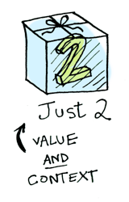
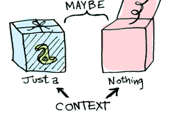

# Типы Данных

- [Типы Данных](#типы-данных)
  - [Введение](#введение)
  - [Custom types](#custom-types)
    - [Зачем cвои типы?](#зачем-cвои-типы)
    - [ADT's - Алгебраические типы данных](#adts---алгебраические-типы-данных)
      - [Немного теории](#немного-теории)
      - [Примеры ADT в Haskell (1/6, enums)](#примеры-adt-в-haskell-16-enums)
      - [Примеры ADT в Haskell (2/6, structures)](#примеры-adt-в-haskell-26-structures)
      - [Примеры ADT в Haskell (3/6, parametric)](#примеры-adt-в-haskell-36-parametric)
      - [Примеры ADT в Haskell (4/6, sum)](#примеры-adt-в-haskell-46-sum)
      - [Примеры ADT в Haskell (5/6, param sum)](#примеры-adt-в-haskell-56-param-sum)
      - [Примеры ADT в Haskell (5.5/6, param sum)](#примеры-adt-в-haskell-556-param-sum)
      - [Примеры ADT в Haskell (5.75/6, Either)](#примеры-adt-в-haskell-5756-either)
      - [Примеры ADT в Haskell (6/6, recursive)](#примеры-adt-в-haskell-66-recursive)
    - [Record types](#record-types)
      - [Record Patterns and Updates](#record-patterns-and-updates)
      - [Operator Record fields](#operator-record-fields)
      - [Records and sum types](#records-and-sum-types)
      - [DuplicateRecordFields](#duplicaterecordfields)
      - [RecordWildCards](#recordwildcards)
      - [newtype](#newtype)
      - [Using types in a wrong way (примеры)](#using-types-in-a-wrong-way-примеры)
  - [Type classes](#type-classes)
    - [Ad-hoc polymorphism](#ad-hoc-polymorphism)
    - [Базовые примеры Type classes: Eq (1/5)](#базовые-примеры-type-classes-eq-15)
    - [Базовые примеры Type classes: Ord (2/5)](#базовые-примеры-type-classes-ord-25)
    - [Базовые примеры Type classes: Num (3/5)](#базовые-примеры-type-classes-num-35)
    - [Базовые примеры Type classes: Show (4/5)](#базовые-примеры-type-classes-show-45)
    - [Базовые примеры Type classes: Read (5/5)](#базовые-примеры-type-classes-read-55)
    - [Полиморфные примеры](#полиморфные-примеры)
    - [Небольшое отступление по поводу undefined](#небольшое-отступление-по-поводу-undefined)
    - [deriving](#deriving)
      - [deriving for functions?](#deriving-for-functions)
      - [GeneralizedNewtypeDeriving](#generalizednewtypederiving)
  - [Шпаргалка по модулям](#шпаргалка-по-модулям)
  - [Extra knowledge](#extra-knowledge)
  - [ADTs as functions (1/2)](#adts-as-functions-12)
    - [Non-recursive ADT as example](#non-recursive-adt-as-example)
  - [ADTs as functions (2/2)](#adts-as-functions-22)
  - [На самом деле Type classes это dictionaries (словари)](#на-самом-деле-type-classes-это-dictionaries-словари)

## Введение

Мы научимся:

- Создавать свои собственные типы данных
- Алгебраические типы данных (ADT)
- Record, NewType - разные сопосбы создать свои типы данных в Haskell
- Type классы
- Полиморфизм
- Модули

## Custom types

### Зачем cвои типы?

Мы ведь можем просто использовать `Tuple`:

```haskell
userFullId :: (Int, String, String) -> String
userFullId (uid, login, name) = show uid ++ ":" ++ login

ghci> userFullId (3, "pumpkin", "Ivan")
"3:pumpkin"
```

Проблема: если мы возьмем другой тип данных - то мы можем что-то перепутать => Нет никаких проверок. (Какие именно проверки станет понятно далее, например из примеров ADT)

---

Можно сделать `Type aliases` (именовать `Tuple`). Сигнатура удобная, красивая:

```haskell
type User = (Int, String, String)

userFullId :: User -> String
userFullId (uid, login, name) = show uid ++ ":" ++ login
```

Проблема: синоним совершенно не добавляет никаких проверок в compile time

Примеры `Type aliases`:

```haskell
type BinaryIntFunction = Int -> Int -> Int
type String            = [Char]
type FilePath          = String
type TripleList a      = [(a, a, a)]
type SwapPair a b      = (a, b) -> (b, a)
```

`String` не всегда лист `Char` (могут быть библиотеки где это не так)

Важно отметить что `Type aliases` спокойно могут быть параметрическими - принимать различные аргументы, что довольно естественно и удобно

---

### ADT's - Алгебраические типы данных

#### Немного теории

Haskell типы строятся на теории алгебраических типов

---

Product types

Над типами оперция произведения (по сути Tuple)

$$
	PT = T_1 \times T_2 \times \ldots \times T_n
$$

C++

```cpp
struct user {
    int uid;
    string login;
    string pass;
};
```

Типы можно воспринимать как множество: если мы сделаем пару из двух типов то у нас получается кол-во элементов которое населяют произведение типов это произведение множеств - берем любой элемент из первого множества, любой из второго и получается произведение.

$$
	user = \texttt{int} \times \texttt{string} \times \texttt{string}
$$

Haskell

```haskell
type User = (Int, String, String)
```

---

Sum types

Над типами оперция сложение

$$
	PT = T_1 + T_2 + \ldots + T_n
$$

Сложно найти аналоги этого в не функциональных яп

Можно привести в пример `std::variant` из c++ - умеет хранить один из типов, и мы можем их различить

---

ADT (Алгебраические типы) - это либо атомманрный тип (Int | Char | Double | ...), либо сумма ADT, либо произведение ADT.

Грамматика как могут выглядить типы

$$
	PrimitiveType = \texttt{Int} \bigg| \texttt{Char} \bigg| \texttt{Double} \bigg| \ldots
$$

$$
	ADT = PrimitiveType \bigg| ADT + ADT \bigg| ADT \times ADT
$$

---

#### Примеры ADT в Haskell (1/6, enums)

```haskell
data TrafficLight = Red | Yellow | Green | Blue

-- pattern matching with types
lightName :: TrafficLight -> String
lightName Red    = "red"
lightName Yellow = "yellow"
lightName Green  = "green"
lightName Blue   = "magenta"

ghci> map lightName [Yellow, Red, Blue, Yellow]
["yellow","red","magenta","yellow"]
```

Важно, что компилятор при перечислении поможет проверить типы. Только надо включить флажок компиляции -Wall.

(GHC can warn you if you don't cover all cases in pattern-matching. So compile programs with -Wall!)

---

#### Примеры ADT в Haskell (2/6, structures)

Кастомный тип данных: User

```haskell
data User = MkUser Int String String
```

Разберем определение

```haskell
      ┌─ type name
      │
      │       ┌─ constructor name (or constructor tag)
      │       │
data User = MkUser Int String String
 │                  │    │      │
 │                  └────┴──────┴── types of fields
 │
 └ "data" keyword
```

- `User` - имя типа
- `MkUser` - имя конструктора

> *Конструкторы это просто функции*

Как получить доступ к полям:

```haskell
getUid :: User -> Int
getUid (MkUser uid _ _) = uid    -- pattern should be in ()

getName :: User -> String
getName (MkUser _ name _) = name
```

Можно проверить тип:

```haskell
ghci> :t MkUser
MkUser :: Int -> String -> String -> User
```

Можно создать список:

```haskell
ghci> import Data.List (nub)
ghci> let users = [ MkUser 2 "Ivan" "123"
                  , MkUser 1 "Mark" "1"
                  , MkUser 3 "Ivan" "xxx"
                  ]
ghci> nub $ map getName users  -- unique names
["Ivan","Mark"]
```

#### Примеры ADT в Haskell (3/6, parametric)

Типы могут быть параметрическими:

```haskell
data Point2D a = Point2D a a  -- constructor name can be the same as type name
```

- `a` - параметр типа (что-то аля шаблонов в c++)
- `Point2D` - имя типа
- `Point2D` - имя конструктора

Тут имя типа совпадает с именем конструктора (компилятор из контекста понимает использовать тип или конструктор)

```haskell
pointToList :: Point2D a -> [a]
pointToList (Point2D x y) = [x, y]

doublePoint :: Point2D a -> Point2D (a, a)
doublePoint (Point2D x y) = Point2D (x, y) (x, y) 

maxCoord :: Point2D Int -> Int
maxCoord (Point2D x y) = max x y

distFromZero :: Point2D Double -> Double
distFromZero (Point2D x y) = sqrt (x^2 + y^2)
```

```haskell
ghci> :t Point2D  -- remeber, constructors are just functions
Point2D :: a -> a -> Point2D a

ghci> pointToList (Point2D 5 10)
[5, 10] 
ghci> doublePoint (Point2D 'a' 'b')
Point2D ('a', 'b') ('a', 'b') 
ghci> maxCoord (Point2D 5 10)
10
ghci> distFromZero (Point2D 5 10)
11.180339887498949
```

---

#### Примеры ADT в Haskell (4/6, sum)

Сумма типов - несколько конструкторов

```haskell
data IntResult = Success Int 
               | Failure String
```

- `IntResult` - имя типа
- `Success`/`Failure` - имена конструкторов

```haskell
ghci> :t Success 
Success :: Int -> IntResult
ghci> :t Failure 
Failure :: String -> IntResult
```

(типа `std::variant`)

```haskell
safeDiv :: Int -> Int -> IntResult
safeDiv _ 0 = Failure "division by zero"
safeDiv x y = Success $ x `div` y

showResult :: IntResult -> String
showResult (Success n) = "Result: " ++ show n
showResult (Failure e) = "Error:  " ++ e

ghci> showResult $ safeDiv 7 2
"Result: 3"
ghci> showResult $ safeDiv 7 0
"Error: division by zero"
```

---

#### Примеры ADT в Haskell (5/6, param sum)

Параметрические суммы

```haskell
data Vector a = Vector2D a a | Vector3D a a a
```

- `Vector` - имя типа
- `a` - параметр типа (что-то аля шаблонов в c++)
- `Vector2D` - имя конструктора
- `Vector3D` - имя конструктора

```haskell
packVector :: Vector a -> [a]
packVector (Vector2D x y)   = [x, y]
packVector (Vector3D x y z) = [x, y, z]

vecLen :: Vector Double -> Double
vecLen = sqrt . sum . map (^2) . packVector

ghci> maximum $ map vecLen [Vector3D 1.1 2.2 4.5, Vector2D 3 4]
5.12835256198

ghci> sortOn vecLen [Vector3D 1.1 2.2 4.5, Vector2D 3 4]
[Vector2D 3.0 4.0, Vector3D 1.1 2.2 4.5]
```

Конструкторы это всё ещё функции, просто полиморфные

```haskell
ghci> :t Vector2D
Vector2D :: a -> a -> Vector a
ghci> :t Vector3D
Vector3D :: a -> a -> a -> Vector a
```

Если мы вызовем `Vector2D` один на `int` дрогой на `string` - получатся разные типы, и мы никак не сможем их проассоциировать, нет у них какого-то общего типа `Vector`, это совершенно разные классы (типы).

---

Можно сделать Type Alias чтобы убрать парметр

```haskell
type IntVector = Vector Int
```

---

> Нельзя создать неколько функций с одним названием но разными аргументами (перегрузку функции). Есть возможность сделать ad hoc полиморфизм, но с конструкторами это не прокатит (мы хотим их различать, например в pattern matching).

---

#### Примеры ADT в Haskell (5.5/6, param sum)

Можно использовать Maybe (аля `std::optional` из c++)

```haskell
data Maybe a = Nothing | Just a  -- implemented in Prelude

ghci> :t Nothing
Nothing :: Maybe a
ghci> :t Just
Just :: a -> Maybe a
```

Попытка сделать null pointer

Maybe это к тому же Монада (будет понятно в следующей лекции)




Его можно воспринимать как коробку в которой может что-то быть или нет

Сделать безопасную функцию извлечения второго элемента:

```haskell
maybeSecond :: [a] -> Maybe a
maybeSecond (_:x:_) = Just x
maybeSecond _       = Nothing
```

> Пояснение: У листа `[]` есть конструктор который называется `:` и принимает head и tail (голову и хвост) - первый элемент и остальной список. `(_:x:_)` - это pattern matching по структуре: есть первый элемент (название `_`(используется для того, что не нужно именовывать)) и остальной список, в остальном списке есть тоже первый элемент назовём `x` и остальной список (название `_`).
>
> () нужно стовить когда внутри есть конструктор, при этом не важно сколько будет внутри конструкторов

---

#### Примеры ADT в Haskell (5.75/6, Either)

Maybe на максималках, Left - означается что вычисление зафейлилось, а Right что вычислилось (используется когда нужно знать доп информацию при ошибке)

```haskell
data Either a b = Left a | Right b  -- implemented in Prelude

ghci> :t Left
Left :: a -> Either a b
ghci> :t Right
Right :: b -> Either a b

eitherSecond :: [a] -> Either String a
eitherSecond []      = Left "list is empty"
eitherSecond [_]     = Left "list has only single element"
eitherSecond (_:x:_) = Right x
```

---

> Совет: Смотрите за порядком мэтчинга, он идет сверху вниз

---

[Обсуждение: Обработка ошибок в haskell](https://stackoverflow.com/questions/48111558/functional-programming-how-to-handle-exceptions-in-functional-programming-or-wh)

---

#### Примеры ADT в Haskell (6/6, recursive)

Типы могут быть рекурсивными:

```haskell
data List a = Nil | Cons a (List a)
```

- `List` - имя типа
- `a` - параметр типа (что-то аля шаблонов в c++)
- `Nil` - имя конструктора
- `Cons` - имя конструктора
- `a (List a)` - принять head и tail (элемент и остальной список)

```haskell
ghci> :t Nil
Nil :: List a
ghci> :t Cons
Cons :: a -> List a -> List a

myList :: List Int
myList = Cons 2 (Cons 1 (Cons 3 Nil))

myMap :: (a -> b) -> List a -> List b
myMap _        Nil  = Nil
myMap f (Cons x xs) = Cons (f x) (myMaap f xs) 

ghci> myMap (`div` 2) myList
Cons 1 (Cons 0 (Cons 1 Nil))
```

Реальный List устроен также, только + синтаксичекий сахар и конструктор это оператор `:`

```haskell
data [] a = [] | a : [a]
```

---

[Обсуждение: Рекурсивные типы данных в Haskell](https://stackoverflow.com/questions/43313747/recursive-datatypes-in-haskell)

---

### Record types

Это Tuple с именнованными полями

Определение:

```haskell
data User = User 
    { uid      :: Int
    , login    :: String
    , password :: String 
    }

ivan :: User
ivan = User { login    = "Ivan"
            , password = "123" 
            , uid      = 1
            }
```

Синтаксический сахар:

```haskell
data User = User Int String String

uid :: User -> Int
uid (User i _ _) = i

login :: User -> String
login (User _ l _) = l

password :: User -> String
password (User _ _ p) = p
```

Использование:

```haskell
isIvan :: User -> Bool
isIvan user = login user == "Ivan"
```

---

#### Record Patterns and Updates

Record field patterns:

```haskell
isIvan :: User -> Bool
isIvan User{ login = userName } = userName == "Ivan"

isIvan :: User -> Bool
isIvan User{ login = "Ivan" } = True
isIvan _                      = False
```

Record update syntax:

```haskell
cloneIvan :: User
cloneIvan = ivan { uid = 2 }  -- User 2 "Ivan" "123"
```

> У нас всё иммутабельное, по этому это просто создаст копию с обновленным полем.

---

#### Operator Record fields

Полем могут быть операторы:

```haskell
ghci> data R = R { (-->) :: Int -> Int }
ghci> let r  = R { (-->) = (+1) }
ghci> r --> 8
9
```

Такой себе оператор, может быть расценен как комментарий (из-за `--`)

---

#### Records and sum types

Можем вместе использовать Record и суммы типов:

```haskell
data Person 
    = User  { uid :: Int, login :: String } 
    | Admin { aid :: Int, login :: String }

login :: Person -> String  -- after desugaring
login (User  _ l) = l
login (Admin _ l) = l

ghci> uid $ Admin 0 "Vasya" 
*** Exception: No match in record selector uid
```

У `admin` нет поля uid, по этому падение

> Records вместе с суммой типов не безопасное сочетание, может падать

Можно написать функцию проверки:

```haskell
isAdmin :: Person -> Bool  -- To match just the type of the construction
isAdmin Admin{} = True     -- works even without records
isAdmin _       = False
```

> Вроде как нельзя опустить фигурные скобки, но это неточно

---

#### DuplicateRecordFields

Есть проблемы с одинаковыми именами полей:

```haskell
data Man = Man { name :: String }
data Cat = Cat { name :: String }

name :: ???
```

Решения:

- Не использовать одинаковые поля

    ```haskell
    data Man = Man { manName :: String }
    data Cat = Cat { catName :: String }
    ```

- Есть расширение, которое создает синтаксический сахар, и пытается из контекста понять какая используется
  - Possible in GHC 8 with -XDuplicateRecordFields (not mature)

    ```haskell
    {-# LANGUAGE DuplicateRecordFields #-}

    data Man = Man { name :: String }
    data Cat = Cat { name :: String }

    shoutOnHumanBeing :: Man -> String
    shoutOnHumanBeing man = (name :: Man -> String) man ++ "!!1!"  -- though...

    isGrumpy :: Cat -> Bool
    isGrumpy Cat{ name = "Grumpy" } = True
    isGrumpy _                      = False
    ```

    [Обсуждение: Как работает расширение](https://stackoverflow.com/questions/44714711/silly-duplicated-record-fields-error/44716184#44716184)

---

#### RecordWildCards

Мы хотим матчинг по полям, но не хотим их все выписывать: (синтаксический сахар) (нужно подключить расширение)

(Fields are functions but with RWC you can treat them as values)

```haskell
{-# LANGUAGE RecordWildCards #-}

data User = User 
    { uid      :: Int
    , login    :: String
    , password :: String 
    } deriving (Show)

toUnsafeString :: User -> String
toUnsafeString User{ uid = 0, .. } = "ROOT: " ++ login ++ ", " ++ password
toUnsafeString User{..}            = login ++ ":" ++ password
```

Работает с DuplicateRecordFields:

```haskell
evilMagic :: Man -> Cat
evilMagic Man{..} = Cat{..}

ghci> evilMagic $ Man "Grumpy"
Cat {name = "Grumpy"}
```

---

#### newtype

```haskell
data    Message = Message String
newtype Message = Message String
```

newtype - частный случай data, когда у типа всего один конструктор и может быть одно поле. Когда один конструктор - мы можем избавится от тега => в Haskell после компиляции и обьявления через `newtype` не будет различий между `Message` и `String`, но всё равно в compile time будут происходить проверки.

[Обсуждение: Различие между data и newtype](https://stackoverflow.com/questions/5889696/difference-between-data-and-newtype-in-haskell)

---

#### Using types in a wrong way (примеры)

```haskell
-- public key from secret key
derivePublicKey :: String -> String

checkKeyPair :: (String, String) -> Bool
checkKeyPair (secretKey, publicKey) 
    = publicKey == derivePublicKey secretKey
```

secretKey и publicKey одно и того же типа, их легко перепутать......

Решение:

```haskell
newtype PublicKey = PublicKey String
newtype SecretKey = SecretKey String
```

compile time guarantees + runtime performance = ❤

```haskell
derivePublicKey :: SecretKey -> PublicKey

checkKeyPair :: (SecretKey, PublicKey) -> Bool
checkKeyPair (secretKey, publicKey) = publicKey == derivePublicKey secretKey
```

---

## Type classes

### Ad-hoc polymorphism

Мы из констекста использования понимаем, что хотим использовать. Например перегрузка оператора + в cpp.

Пример из haskell:

На данный момент вы можете думать о классах типов [как об интерфейсах](https://typeclasses.substack.com/p/typeclasses-in-translation)

```haskell
class Printable p where  -- we don't care what 'p' stores internally
    printMe :: p -> String
```

`class Printable p` - это интерфейс
У нас есть некоторый интерфейс которому некоторые типы могут удовлетворять или нет (входить в этот классс или нет)

Это интерфейс обязует реализовать `printMe` которой принимает `p` - этот тот тип, который будет реализовывать этот класс (класс обьектов которые мы можем распечатать)

И есть enum из data `Foo`:

```haskell
data Foo = Foo | Bar  -- don't care what we can do with 'Foo', care what it stores
```

В Haskell данные и функции для работы с данными разделены.

данные отвечают на вопрос: Что они хранят?

класс отвечает на вопрос: Что мы можем сделать с этими данными?

Связь между данными и ключевым словом class — instance

Мы можем обьвить, что наш тип `Foo` удовлетворяет интерфейсу `Printable`, для этого нужно реализовать функцию `printMe`:

```haskell
instance Printable Foo where
    printMe Foo = "Foo"
    printMe Bar = "Bar (whatever)"
```

И мы можем использовать интерфейс чтобы написать полиморфную функцию:

```haskell
helloP :: Printable p => p -> String
helloP p = "Hello, " ++ printMe p ++ "!"
```

Все проверки по поводу подходит ли `p` к class `Printable` проходят в compile time.

```haskell
ghci> helloP Bar
"Hello, Bar (whatever)!"
ghci> helloP True
    • No instance for (Printable Bool) arising from a use of ‘helloP’
    • In the expression: helloP True
```

---

### Базовые примеры Type classes: Eq (1/5)

Можно писать интерфейсы с дефолтной реализацией: (необязательно при обьявлении, можно ниже)

```haskell
class Eq a where  
    (==) :: a -> a -> Bool  
    (/=) :: a -> a -> Bool
 
    x == y = not (x /= y)  
    x /= y = not (x == y)
    {-# MINIMAL (==) | (/=) #-}  -- minimal complete definition
```

В чем плюс определять "равно" и "не равно" друг через друга (рекурсивно) - для того чтобы дать гибкость пользователю, можно будет реализовать только одну из функцию, вторую получишь на халяву

Это всё проверяется в compile time, но у нас уже всё реализованно, и если мы не будем ничего трогать - возникнет саморекурсия, для этого есть деректива `{-# MINIMAL (==) | (/=) #-}` - она обьявляет минимальные наборы того, что нужно реализовать самостоятельно

Для того, чтобы явно использовать тип в реализации есть инстанс `-XInstanceSigs` (It's suggested to use [-XInstanceSigs](https://downloads.haskell.org/ghc/latest/docs/users_guide/glasgow_exts.html#instance-signatures-type-signatures-in-instance-declarations) to specify types of methods)

```haskell
{-# LANGUAGE InstanceSigs #-}

data TrafficLight = Red | Yellow | Green

instance Eq TrafficLight where
    (==) :: TrafficLight -> TrafficLight -> Bool
    Red    == Red    = True  
    Green  == Green  = True  
    Yellow == Yellow = True 
         _ == _      = False

threeSame :: Eq a => a -> a -> a -> Bool
threeSame x y z = x == y && y == z

ghci> threeSame Red Red Red
True
ghci> threeSame 'a' 'b' 'b'
False
```

---

### Базовые примеры Type classes: Ord (2/5)

Когда мы хотим наложить ограничения на тип в type class: (например для сравнения)

```haskell
data Ordering = LT | EQ | GT

-- simplified version of Ord class
class Eq a => Ord a where
   compare              :: a -> a -> Ordering
   (<), (<=), (>=), (>) :: a -> a -> Bool

   compare x y
        | x == y    =  EQ
        | x <= y    =  LT
        | otherwise =  GT

   x <= y           =  compare x y /= GT
   x <  y           =  compare x y == LT
   x >= y           =  compare x y /= LT
   x >  y           =  compare x y == GT
```

`class Eq a => Ord a where` => `Ord a` - ограничение, что тип должен уметь сравниваться

[Must see: Edward Kmett - Type Classes vs. the World](https://www.youtube.com/watch?v=hIZxTQP1ifo)

---

### Базовые примеры Type classes: Num (3/5)

Числа в Haskell тоже полиморфные, обычная 7 может быть как float так и int

> Когда вы пишете что-то вроде 7, это просто синтаксический сахар для fromInteger 7. Вот почему числовые константы полиморфны.

```haskell
-- | Basic numeric class.
class Num a where
    {-# MINIMAL (+), (*), abs, signum, fromInteger, (negate | (-)) #-}

    (+), (-), (*)       :: a -> a -> a  -- self-explained
    negate              :: a -> a       -- unary negation
    abs                 :: a -> a       -- absolute value
    signum              :: a -> a       -- sign of number, abs x * signum x == x
    fromInteger         :: Integer -> a -- used for numeral literals polymorphism

    x - y               = x + negate y
    negate x            = 0 - x
```

```haskell
ghci> :t 5
5 :: Num p => p
ghci> :t fromInteger 5
fromInteger 5 :: Num a => a
ghci> 5 :: Int
5
ghci> 5 :: Double
5.0
```

---

### Базовые примеры Type classes: Show (4/5)

Это Printable из основной библиотеки

```haskell
-- simplified version; used for converting things into String
class Show a where
    show :: a -> String
```

Show используется (например), когда значения печатаются в GHCi:

```haskell
ghci> 5
5
ghci> show 5
"5"
ghci> "5"
"5"
ghci> show "5"
""5""
```

Отображение различных числовых значений:

```haskell
ghci> 5 :: Int
5
ghci> 5 :: Double
5.0
ghci> 5 :: Rational
5 % 1
```

---

### Базовые примеры Type classes: Read (5/5)

Нужен для парсинга

```haskell
-- simplified version; used for parsing thigs from String
class Read a where
    read :: String -> a
```

Use Read when you need to parse String. Though be careful.

```haskell
ghci> :t read
read :: Read a => String -> a
ghci> read "True"
*** Exception: Prelude.read: no parse
ghci> read "True" :: Bool
True
```

read throws runtime exception. Use readMaybe/readEither.

```haskell
ghci> :module Text.Read  -- safe read functions are not in Prelude, unfortunately

ghci> :t readMaybe
readMaybe :: Read a => String -> Maybe a
ghci> :t readEither 
readEither :: Read a => String -> Either String a
ghci> readMaybe "5" :: Maybe Int
Just 5
ghci> readMaybe "5" :: Maybe Bool
Nothing
ghci> readEither "5" :: Either String Bool -- don't worry, convenient way exist
Left "Prelude.read: no parse"
```

---

### Полиморфные примеры

Вычитание:

```haskell
subtract :: Num a => a -> a -> a
subtract x y = y - x
```

Fractional:

```haskell
ghci> :info Fractional
class Num a => Fractional a where
  (/) :: a -> a -> a
  recip :: a -> a
  fromRational :: Rational -> a
  {-# MINIMAL fromRational, (recip | (/)) #-}
    -- Defined in ‘GHC.Real’
instance Fractional Float -- Defined in ‘GHC.Float’
instance Fractional Double -- Defined in ‘GHC.Float’

average :: Fractional a => a -> a -> a
average x y = (x + y) / 2
```

Какой наибольший общий тип этой функции:

```haskell
cmpSum x y = if x < y then x + y else x * y
```

GHCI тебе поможет в этом!

```haskell
ghci> cmpSum x y = if x < y then x + y else x * y
ghci> :t cmpSum
cmpSum :: (Ord a, Num a) => a -> a -> a
```

> Здесь нет никакой таблицы виртуализации и т.д. как в cpp, `Ord` и `Num`принимается в виде неявного аргумента в `cmpSum`.

Вопрос:

> Почему в числах нет требования к сравнению?
>
> Зачем оно, могут же быть комплексные числа, кольца, там не выполняется правило треугольника (что-то такое). Зачем нам требовать больше чем нужно, мы нигде не используем Ord...

---

### Небольшое отступление по поводу undefined

Есть функции `undefined`, это некоторое вычисление которое не завершается, бесконечно циклится, и теоритически это означает, что оно имеет тип false - ложь - оно совершенно любого типа. Мы можем подставить undefined вместо любого выражения в коде.

> это bottom в теории типов `_|_`

```haskell
ghci> :t undefined
undefined :: a
ghci> undefined
*** Exception: Prelude.undefined
CallStack (from HasCallStack):
  error, called at libraries/base/GHC/Err.hs:79:14 in base:GHC.Err
  undefined, called at <interactive>:44:1 in interactive:Ghci27

foo :: (Ord a, Read a, Show b) => String -> a -> b -> b -> String
foo = undefined -- too difficult to implement
```

> undefined: write tomorrow, typecheck today!

Есть ещё `error` который тот же `undefined`, но при попытке его вычислить выкинет не только exception, но и заданную строчку (ошибку)

```haskell
ghci> :t error
error :: [Char] -> a
ghci> error "Some meaningful message"
*** Exception: Some meaningful message
CallStack (from HasCallStack):
  error, called at <interactive>:46:1 in interactive:Ghci27

foo :: (Ord a, Read a, Show b) => String -> a -> b -> b -> String
foo = error "Function `foo` crashes your code, don't call it!" 
```

> **undefined and error can exist on prototyping stage. But, please, try not to use these functions.**

---

### deriving

Допустим, у нас есть traffic light, и мы не хотим для него определять все инстансы. Можем писать просто deriving, специальный кейворд deriving `Eq`, и он выведет нам все инстансы.

```haskell
data TrafficLight = Red | Yellow | Green | Blue
    deriving Eq  -- autoderiving instances
```

Можем написать кучу:

```haskell
data TrafficLight = Red | Yellow | Green | Blue
    deriving (Eq, Ord, Enum, Bounded, Show, Read, Ix)
```

Всё работает автоматом:

```haskell
ghci> show Blue
"Blue"
ghci> read "Blue" :: TrafficLight 
Blue

ghci> Red == Yellow  -- (==) is from Eq  class
False
ghci> Red < Yellow   -- (<)  is from Ord class
True

ghci> :t fromEnum 
fromEnum :: Enum a => a -> Int
ghci> :t toEnum 
toEnum :: Enum a => Int -> a
ghci> fromEnum Green
2
ghci> toEnum 2 :: TrafficLight 
Green

ghci> :t maxBound 
maxBound :: Bounded a => a
ghci> maxBound :: TrafficLight  -- Bounded also has 'minBound'
Blue
ghci> [Yello .. maxBound]  -- .. is from Enum instance
[Yellow, Green, Blue] 
```

---

#### deriving for functions?

```haskell
data FunBox = FB (Int -> String)  -- remember? functions are first class values
    deriving (Eq, Ord, Enum, Bounded, Show, Read, Ix) -- what can we derive?
```

Что если у нас есть какой-то дататайп, который хранит функцию? Что если мы для него попросим вывести? Суть в том, что мы не можем гарантировать, что во всех случаях мы можем вывести хотя бы какой-то тривиальный инстанс. То есть есть функции, которые непонятно, как печатать, например, или читать из строки. Поэтому нужно понимать, что
все это некоторые эвристики, которые не всегда работают.

> Надо уточнить. Бывает так, что он сгенерит тебе что-то, но для функции она не работает совсем.

---

#### GeneralizedNewtypeDeriving

**Do you see problems?**

```haskell
newtype Size = Size Int
    deriving (Show, Read, Eq, Ord, Num)
```

Нам, допустим, нужно реализовать метод show. Для этого нужно сделать паттерн-матчинг по этому элементу. У нас не просто enum и сравниваются, а надо какой-то паттерн-матчинг делать, еще что-то, потом обратно это заворачивать. В общем, с этим есть проблема. Это уже не включено в язык стандартный, но есть расширение, называется `generalized NewType deriving`, которое это все делает.

```haskell
{-# LANGUAGE GeneralizedNewtypeDeriving #-}

newtype Size = Size Int
    deriving (Show, Read, Eq, Ord, Num)
```

Typical newtype deriving:

```haskell
newtype TxpHolder m a = TxpHolder
    { getTxpHolder :: ReaderT TxpLocalData m a
    } deriving ( Functor
                 , Applicative
                 , Monad
                 , MonadTrans
                 , MonadThrow
                 , MonadSlotsData
                 , MonadS lots
                 , MonadCatch
                 , MonadIO
                 , MonadFail
                 , HasLoggerName
                 , WithNodeContext ssc
                 , MonadJL
                 , CanLog
                 , MonadMask
                 , MonadSscMem ssc
                 , MonadFix
                 , MonadDhtMem
                 , MonadReportingMem
                 , MonadRelayMem
                 , MonadShutdownMem
                 , MonadDB
                 , MonadDBLimits )
```

[Обсуждение: Что делать если список deriving слишком длинный](https://stackoverflow.com/questions/45113205/is-there-a-way-to-shorten-this-deriving-clause)

---

## Шпаргалка по модулям

> Теперь давайте посмотрим модули. Есть проблема вот с type-классами. Чем они отличаются от классов в плюсах, например.
>
> У нас нет области видимости, у нас нет вот этого вот public полей, private полей, вот этого всего нет. У нас все public всегда.
>
> Но можно похожую функциональность
реализовать с помощью модулей.

---

> Модуль — это набор кода, который мы можем отдельно скомпилировать, потом куда-то заимпортить.

```haskell
module Lib 
       ( module Exports
       , FooB1 (..), FooB3 (FF)
       , Data.List.nub, C.isUpper
       , fooA, bazA, BAZB.isLower
       ) where
```

Мы указываем после lib в скобочках те функции, те модули, те типы, которые мы экспозируем, которые мы делаем открытыми для импорта. Если есть какие-то детали реализации, мы просто их не добавляем в этот список, и они остаются закрытыми.

---

Модули имеют иерархию какую-то. Иерархия строится, по-моему, как в Java

```haskell
import           Foo.A
```

Можем дальше в скобочках написать, что мы конкретно
хотим заимпортить. Например, мы импортим тип FooB2 и один его конструктор MkB1. FooB3 мы импортим все его конструкторы, если не напишем (..) - не будем ипортить никакие его конструкторы

```haskell
import           Foo.B     (FooB2 (MkB1), 
                            FooB3 (..))
```

hiding - заимпортить всё кроме

```haskell
import           Prelude   hiding (print)
```

Импорт оператора:

```haskell
import           Bar.A     (print, (<||>))
```

> работает правило, что если мы импортим модуль, то мы импортим все его инстансы и все классы.

Ипорт только инстансов и классов:

```haskell
import           Bar.B     ()
```

Переименование при импорте:

```haskell
import           Baz.A     as BAZA 
```

qualified - Для любого символа который мы импортировали из модуля, мы обязаны указывать его квалификатор (полное имя). Можно комбинировать с переименованием `as` и т.д.

```haskell
import qualified Data.List
import qualified Data.Char as C hiding (chr)
import qualified Baz.B     as BAZB (isLower)
```

"Обьеденить" модули:

```haskell
import qualified Foo.X     as Exports
import qualified Foo.Y     as Exports
```

---

Примеры:

```haskell
module Foo.A where fooA = 3
```

```haskell
module Foo.B 
       ( FooB1, FooB2 (..), 
         FooB3 (FF, val)
       ) where

data FooB1 = MkFooB1
data FooB2 = MkB1 | MkB2
data FooB3 = FF { val :: Int }
```

```haskell
module Bar.B () where

class Printable p where 
    printMe :: p -> String

instance Printable Int where 
    printMe = show
```

```haskell
module Baz.A (bazA) where bazA = map
```

```haskell
module Baz.B (C.isLower) where 

import Data.Char as C
```

---

> Два модуля в одном файле обьявлять нельзя. Но модуль может экспортировать модуль

---

## Extra knowledge

- [LearnYouAHaskell (chapters 3, 8)](https://learnyouahaskell.com/)
- [HaskellWikiBook: More on datatypes Wiki](https://en.wikibooks.org/wiki/Haskell/More_on_datatypes)
- [HaskellWikiBook: Classes and Types](https://en.wikibooks.org/wiki/Haskell/Classes_and_types)
- [Philip Wadler «How to make ad-hoc polymorphism less ad hoc» 1988](http://people.csail.mit.edu/dnj/teaching/6898/papers/wadler88.pdf)

---

## ADTs as functions (1/2)

### Non-recursive ADT as example

```haskell
data Doctor who = Tardis who who | Dalek Int
```

```haskell
timeTravel :: a -> a -> String
timeTravel _ _ = "Travel through time and space!"

exterminate :: Int -> String
exterminate n = unwords $ replicate n "Exterminate!"

travel :: Doctor who -> String
travel (Tardis a b) = timeTravel a b
travel (Dalek x)    = exterminate x
```

```haskell
ghci> travel (Tardis 0 0)
"Travel through time and space!"
ghci> travel (Dalek 3)
"Exterminate! Exterminate! Exterminate!"
```

## ADTs as functions (2/2)

[If you have HOF, you have ADT by Church-encoding ADT as functions](http://neerc.ifmo.ru/wiki/index.php?title=%D0%A4%D1%83%D0%BD%D0%BA%D1%86%D0%B8%D0%BE%D0%BD%D0%B0%D0%BB%D1%8C%D0%BD%D0%BE%D0%B5_%D0%BF%D1%80%D0%BE%D0%B3%D1%80%D0%B0%D0%BC%D0%BC%D0%B8%D1%80%D0%BE%D0%B2%D0%B0%D0%BD%D0%B8%D0%B5#A1._.D0.97.D0.B0.D0.BA.D0.BE.D0.B4.D0.B8.D1.80.D0.BE.D0.B2.D0.B0.D1.82.D1.8C_.D1.82.D0.B8.D0.BF.D1.8B_.D0.BF.D0.BE_.D0.A7.D1.91.D1.80.D1.87.D1.83_.28.D0.B1.D0.B5.D0.B7_.D0.B2.D0.B7.D0.B0.D0.B8.D0.BC.D0.BD.D0.BE.D0.B9_.D1.80.D0.B5.D0.BA.D1.83.D1.80.D1.81.D0.B8.D0.B8.29)

```haskell
data Doctor who = Tardis who who 
                | Dalek Int
```

```haskell
ghci> :t Tardis 
Tardis :: who -> who -> Doctor who
ghci> :t Dalek 
Dalek :: Int -> Doctor who
```

```haskell
f_Tardis :: who -> who -> (who -> who -> r) -> (Int -> r) -> r
f_Tardis a b = \tardis _dalek -> tardis a b

f_Dalek :: Int -> (who -> who -> r) -> (Int -> r) -> r
f_Dalek x = \_tardis dalek -> dalek x

f_travel :: ((who -> who -> String) -> (Int -> String) -> String) -> String
f_travel pattern = pattern timeTravel exterminate
```

```haskell
ghci> f_travel (f_Tardis 0 0)
"Travel through time and space!"

ghci> f_travel (f_Dalek 3)
"Exterminate! Exterminate! Exterminate!"
```

***ИЛИ*** Если мы хоти нормальную сигнатуру (с помощью Чёртчинг-кодинг)

```haskell
data Doctor who = Tardis who who 
                | Dalek Int

type Doctor_f who r = (who -> who -> r) -> (Int -> r) -> r

f_Dalek :: Int -> Doctor_f who r
f_Dalek x = \_tardis dalek -> dalek x

f_Dalek :: Int -> Doctor_f who r
f_Dalek x = \_tardis dalek -> dalek x

f_travel :: Doctor_f who String -> String
f_travel pattern = pattern timeTravel exterminate
```

This can be done better with sophisticated language extensions

---

## На самом деле Type classes это dictionaries (словари)

Инстансы, на самом деле, это просто, tuple, с объектами.

```haskell
class Eq a where  
    (==) :: a -> a -> Bool  
    (/=) :: a -> a -> Bool
    x == y = not (x /= y)  
    x /= y = not (x == y)
class Eq a where  
    (==) :: a -> a -> Bool  
    (/=) :: a -> a -> Bool
    x == y = not (x /= y)  
    x /= y = not (x == y)

instanceEqCWithEq :: (a -> a -> Bool) -> EqC a
instanceEqCWithEq myEq = EqDict 
    { eq  = myEq
    , neq = \x y -> not $ x `myEq` y }

instanceEqCWithNeq :: (a -> a -> Bool) -> EqC a
instanceEqCWithNeq myNeq = EqDict 
    { eq  = \x y -> not $ x `myNeq` y
    , neq = myNeq }

isInList :: EqC a -> a -> [a] -> Bool
isInList eqc x = any (eq eqc x)
```

```haskell
ghci> isInList (instanceEqCWithEq (==)) 3 [2, 1, 3]
True
```

[SchoolOfHaskell: Instances and disctionaries](https://www.schoolofhaskell.com/user/jfischoff/instances-and-dictionaries)

[Haskell for all: Scrap your type classes](http://www.haskellforall.com/2012/05/scrap-your-type-classes.html)

---

- [Типы Данных](#типы-данных)
  - [Введение](#введение)
  - [Custom types](#custom-types)
    - [Зачем cвои типы?](#зачем-cвои-типы)
    - [ADT's - Алгебраические типы данных](#adts---алгебраические-типы-данных)
      - [Немного теории](#немного-теории)
      - [Примеры ADT в Haskell (1/6, enums)](#примеры-adt-в-haskell-16-enums)
      - [Примеры ADT в Haskell (2/6, structures)](#примеры-adt-в-haskell-26-structures)
      - [Примеры ADT в Haskell (3/6, parametric)](#примеры-adt-в-haskell-36-parametric)
      - [Примеры ADT в Haskell (4/6, sum)](#примеры-adt-в-haskell-46-sum)
      - [Примеры ADT в Haskell (5/6, param sum)](#примеры-adt-в-haskell-56-param-sum)
      - [Примеры ADT в Haskell (5.5/6, param sum)](#примеры-adt-в-haskell-556-param-sum)
      - [Примеры ADT в Haskell (5.75/6, Either)](#примеры-adt-в-haskell-5756-either)
      - [Примеры ADT в Haskell (6/6, recursive)](#примеры-adt-в-haskell-66-recursive)
    - [Record types](#record-types)
      - [Record Patterns and Updates](#record-patterns-and-updates)
      - [Operator Record fields](#operator-record-fields)
      - [Records and sum types](#records-and-sum-types)
      - [DuplicateRecordFields](#duplicaterecordfields)
      - [RecordWildCards](#recordwildcards)
      - [newtype](#newtype)
      - [Using types in a wrong way (примеры)](#using-types-in-a-wrong-way-примеры)
  - [Type classes](#type-classes)
    - [Ad-hoc polymorphism](#ad-hoc-polymorphism)
    - [Базовые примеры Type classes: Eq (1/5)](#базовые-примеры-type-classes-eq-15)
    - [Базовые примеры Type classes: Ord (2/5)](#базовые-примеры-type-classes-ord-25)
    - [Базовые примеры Type classes: Num (3/5)](#базовые-примеры-type-classes-num-35)
    - [Базовые примеры Type classes: Show (4/5)](#базовые-примеры-type-classes-show-45)
    - [Базовые примеры Type classes: Read (5/5)](#базовые-примеры-type-classes-read-55)
    - [Полиморфные примеры](#полиморфные-примеры)
    - [Небольшое отступление по поводу undefined](#небольшое-отступление-по-поводу-undefined)
    - [deriving](#deriving)
      - [deriving for functions?](#deriving-for-functions)
      - [GeneralizedNewtypeDeriving](#generalizednewtypederiving)
  - [Шпаргалка по модулям](#шпаргалка-по-модулям)
  - [Extra knowledge](#extra-knowledge)
  - [ADTs as functions (1/2)](#adts-as-functions-12)
    - [Non-recursive ADT as example](#non-recursive-adt-as-example)
  - [ADTs as functions (2/2)](#adts-as-functions-22)
  - [На самом деле Type classes это dictionaries (словари)](#на-самом-деле-type-classes-это-dictionaries-словари)
