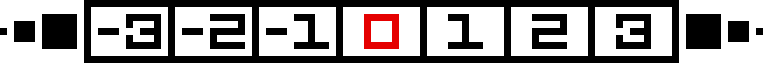
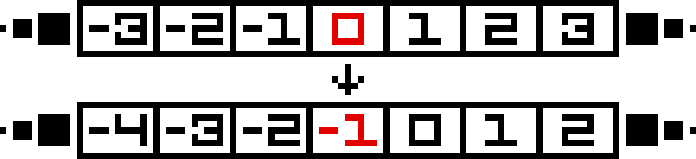
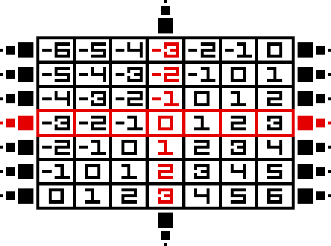
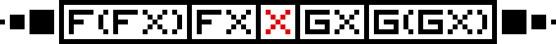
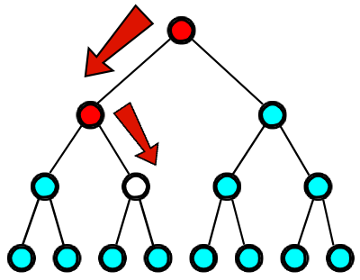

# Комонады

## Концепция комонад

Приставка "ко" в слове, в данном случае, означает *дуальность*. Конкретное определение лежит в основе идеи комонады: давайте вспомним про две основные функции монад `join` и `return`, а именно про их сигнатуры.

```haskell
return :: a -> t a
join   :: t (t a) -> t a
```

А если развернуть стрелки? Мы получаем функцию `extract`, которая вытаскивает `a` из контекста `t` и `duplicate`, которая как бы дублирует контекст.

```haskell
extract   :: t a -> a
duplicate :: t a -> t (t a)
```

Собственно, вот и идея комонад - в этих двух функциях, остаётся что-то сделать с bind. Вспомним про стрелку Клейсли: `(a -> t b)`, где `t` - это как минимум функтор или (обычно) стрелка. Давайте её также развернём: получаем `(t a -> b)` - стрелка Коклейсли, взяли `a` в контексте и преобразовали её в `b`, при этом отбросив контекст. Теперь внимательно посмотрим на функцию bind.

```haskell
bind :: (a -> t b) -> (t a -> t b)
-- в отличии от изначальной сигнатуры, мы здесь поменяли местами первый и второй аргументы,
-- теперь мы можем воспринимать эту функцию, как принимающая функцию `(a -> t b)`
-- и возвращающая функцию трансформации из `(t a -> t b)`
```

Таки давайте мы поменяем стрелку Клейсли на Коклейсли и получим функцию, которую обычно именуют `extend`.

```haskell
extend :: (t a -> b) -> (t a -> t b)
```

В техническом плане, `Comonad` - это `Functor`, потому что раньше в Haskell не было `Applicative`, а нынешний constraint остаётся таким же.

```haskell
class Functor w => Comonad w where
  extract   :: w a -> w
  duplicate :: w a -> w (w a)
  -- заметим, что `duplicate` можно реализовать через `extend`:
  -- `extend id x`
  extend    :: (w a -> b) -> w a -> w b
  -- заметим, что `extend` можно реализовать через `duplicate`:
  -- `fmap f (duplicate x)`
```

У комонады, как и у монады, есть и операторная форма функции `extend`.

```haskell
(=>>) :: Comonad w => w a -> (w a -> b) -> w b
-- выглядит почти как `(>>=)`
(=>>) = flip extend
-- поскольку у `extend` немного изменен порядок аргументов,
-- приходится исправлять через `flip`
```

Пример самой тривиальной комонады - `Identity`.

```haskell
data Identity a = Identity { runIdentity :: a }
-- возвращает саму себя
```

```haskell
instance Comonad Identity where
  extract = runIdentity
  -- мы вытаскиваем из контекста значение
  -- в данном случае - просто используем данную нам функцию

  duplicate = Identity
  -- мы заворачиваем в ещё один контекст
  -- в данном случае - просто запихиваем значение `Identity` как тип `a` в `Identity`
```

Как и у монады есть некоторые правила, с которыми согласны все при использовании комонады. Введем, как и в случае монады, композицию двух комонад, назовем это композицией Коклейсли.

```haskell
(=<=) :: Comonad w => (w b -> c) -> (w a -> b) -> (w a -> c)
g =<= f = \x -> g (x =>> f)
-- здесь: `\x` - это `w a`
--        `x =>> f` - extend `w a` и получение `w b`
-- наконец, полученный `w b` передаём в функцию `g` типа `w b -> c`
```

По правилам - мы получаем ровно те же, но только стрелки разворачиваются и меняются одни функции на другие.

* В терминах `(=<=)`.
  1. Ассоциативность.

      ```haskell
      (h =<= g) =<= f === h =<= (g =<= f)
      ```

  2. Тождество.

      ```haskell
      extract =<= f === f
      f =<= extract === f
      ```

* В терминах `(=>>)` - левоассоциативная функция, как bind.
  1. Ассоциативность.

      ```haskell
      w =>> f =>> g === w =>> (\x -> g (x =>> f))
      ```

  2. Тождество.

      ```haskell
      extract (x =>> f) === f x
      -- `extract` от `extend` - это `extend`
      -- или: применение к `x`

      w =>> extract     === w
      -- передача в `w` в `extract` никак не меняет результат
      ```

В чем принципиальная разница между монадой и комонадой, кроме повернутых стрелок? Монады обычно нужны для вычислений с выходом *эффектов от вычислений*. Комонады же - вычисляются в *контекстно-зависимые вычисления*.

## The List Zipper

**List Zipper** - это структура данных, оперирующая с списками и с *фокусированным элементом*.

```haskell
data ListZipper a = LZ [a] a [a]
-- левый `[a]` - это значения, которые стоят левее сфокусированного значения
-- правый `[a]` - это значения, которые стоят правее сфокусированного значения
-- `a` - это сфокусированное значение
```

Визуально `ListZipper` выглядит следующим образом.



Красным у нас обозначен *сфокусированный* элемент, слева от него у нас стоит список, который **может быть бесконечным**, справа - также список, который **может быть бесконечным**.

В коде `ListZipper` по расположению элементов выглядит немного по другому.

```haskell
example :: ListZipper Int
example = LZ [-1, -2, -3] 0 [-1, -2, -3]
```

Почему не также в обратную сторону, как на картинке выше? Потому что:

1. мы легко можем взять голову - левый элемент от фокуса
2. мы легко можем перемещаться дальше по `ListZipper`

Перезапись сфокусированного элемента достаточно тривиально - подставляем вместо старого новое.

```haskell
lWrite :: a -> ListZipper a -> ListZipper a
lWrite x (LZ ls _ rs) = LZ ls x rs
```

Также, мы захотим взять и представить `ListZipper` в виде списка. Внимание: поскольку списки слева и справа от фокусированного значения могут быть бесконечны, то для безопасности следует брать первые $n$ элементов слева и справа.

```haskell
toList :: ListZipper a -> Int -> [a]
toList (LZ ls x rs) n = reverse (take n ls) ++ [x] ++ take n rs
-- мы делаем `reverse`, чтобы получить элементы так, как на картинке выше
```

Мы можем также двигаться по `ListZipper`. Определим функции передвижения, например, влево: по определению `ListZipper` мы хотим заменить нынешнее фокусированное значение на новое-голову слева, старую поместить вправо. Аналогично движение вправо.

```haskell
lLeft, lRight :: ListZipper a -> ListZipper a

lLeft  (LZ (l : ls) c rs) = LZ ls l (c : rs)
lLeft  lz = lz

lRight (LZ ls c (r : rs)) = LZ (c : ls) r rs
lRight lz = lz
```

Демонстрация, где красное значение - это сфокусированное значение.



Внезапно, мы можем доказать, что `ListZipper` - это комонада. Для начала, давайте определим для него функтор (так как, комонада - это как минимум именно функтор).

```haskell
instance Functor ListZipper where
  fmap f (LZ ls x rs) = LZ (map f ls) (f x) (map f rs)
  -- есть `ListZipper` с сфокусированным значением и списки тех же типов
  -- тогда, мы можем применить на этом значении нашу функцию и протащить её в списки,
  -- использовав функцию `map` для превращения `[a] -> [b]` 
```

Также, мы можем легко определить функцию `extract`: как мы помним эта функция убирает контекст и возвращает само значение. В данном случае контекстом является весь объект (то есть, списки слева и справа, и сам фокус). Тогда, давайте вернем сфокусированное значение.

```haskell
extract :: ListZipper a -> a
extract (LZ _ x _) = x
```

Демонстрация: красное - это сфокусированное значение.


Остаётся реализовать функцию `duplicate`. Что она означает? Мы контекст запихиваем в тот же новый контекст, в данном же случае, у нас получается сетка или матрица `ListZipper`'ов, который выглядит примерно следующим образом.



Итак: *внешние* (в типе `ListZipper (ListZipper a)`) `ListZipper`'ы идут по *вертикали*; *верхние* `ListZipper`'ы - это "левые" `ListZipper`'ы, *нижние* - это "правые". *Центральный* `ListZipper` - это сфокусированный `ListZipper` (внешний). Обратим внимание на красный `ListZipper`: он сфокусированный и на основе него которого мы будем делать операцию `duplicate` - тот, который по *горизонтали*. Посмотрим на операции перемещения в такой решётке: если движемся влево внешним способом, то мы движемся влево внутренним образом (`-1` от `0` *ВЫШЕ*), идем ещё раз влево (значит, идём внутренним образом влево) и получаем `-2` от `-1` ВЫШЕ. Аналогично: идем вправо внешне - идем вправо внутренне, значит из `0` мы получаем `1` *НИЖЕ* и так далее.

Сначала разберёмся с генерацией `ListZipper`. Вспомним про две стандартные функции: `iterate` (возвращает бесконечный список применения функции `f` над изначальным элементом `a`: `[a, f a, f (f a), f (f (f a)) ..]`) и `tail` (возвращает всё, кроме первого элемента). Объединим их в одну - хотим получить всё остальное, кроме `a`.

```haskell
iterateTail :: (a -> a) -> a -> [a]
iterateTail f = tail . iterate f

-- пример --
ghci> take 5 $ iterateTail (*2) 1
[2, 4, 8, 16, 32]
```

Давайте через эту функцию и определим генерацию `ListZipper`. Мы возьмем две функции `f` и `g` и начнём применять их бесконечно влево и вправо (без самого фокусного элемента), так как слева и справа могут быть бесконечные списки.

```haskell
lGenerator :: (a -> a)
           -> (a -> a)
           -> a
           -> ListZipper a
lGenerator f g x = LZ (iterateTail f x) x (iterateTail g x)
```

Демонстрация: красный `x` - это и фокусное значение, и начальное значения для дальнейшего применения `f` и `g`.



Тогда, генерация непосредственно решётки - и есть в точности генерация от `ListZipper` через `lGenerator` - хождением влево (то есть, элементы "выше" начального значения) и хождением вправо (то есть, элементы "ниже").

```haskell
duplicate :: ListZipper a -> ListZipper (ListZipper a)
duplicate = lGenerator lLeft lRight
```

Назовем данный тип как `Grid`, чтобы не путаться и попробуем для него определить методы.

```haskell
newtype Grid a = Grid { unGrid :: ListZipper (ListZipper a) }
```

Как уже было сказано ранее, у нас элементы есть выше и ниже, те, которые выше - это слева от нас стоящие, ниже - справа (смотри картинку выше).

```haskell
gUp, gDown :: Grid a -> Grid a
gUp   (Grid g) = Grid (lLeft  g)
gDown (Grid g) = Grid (lRight g)
```

Научимся ходить влево и вправо: чтобы пойти влево, нам нужно пропихнуть операцию хода влево (именно уже `ListZipper`'а) во все остальные `ListZipper`'ы - таким образом, мы пойдем и выше, ниже также влево.

```haskell
gLeft, gRight :: Grid a -> Grid a
gLeft  (Grid g) = Grid (fmap lLeft  g)
gRight (Grid g) = Grid (fmap lRight g)
```

И, в качестве ещё одной фундаментальной функции, придумаем, как записывать на месте сфокусированного значения новое значение. Пусть нам дан `ListZipper (ListZipper a)` - тогда, давайте вытащим оттуда центральный из них (функция `extract`, реализованная ранее), затем перепишем туда значение (функция `lWrite`), наконец, воспользуемся снова функцией записи в `ListZipper` только запишем именно в старое поле (типы совпадают - а центральный перезапишется на новое значение).

```haskell
gWrite :: a -> Grid a -> Grid a
gWrite x (Grid g) = Grid $ lWrite newLine g
  where
    oldLine = extract g
    newLine = lWrite x oldLine
```

Наконец, докажем, что `Grid` - это комонада. `extract` легко реализуется - нам нужно из `ListZipper (ListZipper a)` достать сфокусированный элемент - это просто дважды примененный `extract` из `ListZipper` (выше реализовывали). А вот с `duplicate` возникает проблемы - нам нужны две вспомогательные функции для получения всех горизонтальных и вертикальных элементов.

```haskell
gHorizontal, gVertical :: Grid a -> ListZipper (Grid a)
gHorizontal = lGenerator gLeft gRight
-- для понимания нужно представить плоскость в трехмерном пространстве, будем считать вглубь
-- давайте вглубь будем идти слева, а снаружи - вправо, то есть
-- вглубь мы двигаем каждый из `ListZipper`'ов внутренних влево
-- снаружи мы двигаем каждый из `ListZIpper`'ов внешних вправо
-- получаем куб из всевозможных горизонтальных `Grid`'ов
gVertical   = lGenerator gUp   gDown
```

Доделаем instance для комонады `Grid`.

```haskell
instance Comonad Grid where
  extract :: Grid a -> a
  extract = extract . extract . unGrid

  duplicate :: Grid a -> Grid (Grid a)
  duplicate = Grid . fmap gHorizontal . gVertical
  -- 1. `gVertical`   - расширились до 3-х мерного пространства
  -- 2. `gHorizontal` - расширились до 4-х мерного пространства
  -- 3. всё это мы проделываем для каждого элемента из `Grid`'а
  -- 4. запихиваем результат в `Grid`
```

### Conway's Game of Life

Реализуем бесконечную [игру Жизнь](https://en.wikipedia.org/wiki/Conway%27s_Game_of_Life) на реализованном `Grid`. Будем использовать в качестве значений `Bool`'ы, чтобы считать, кто жив-кто мёртв.

Создадим утилитарную функцию для подсчёта "живых" клеток.

```haskell
aliveCount :: [Bool] -> Int
aliveCount = length . filter id
-- если "живой", то это True - +1
```

Также, по канону, нам нужны ещё и множество соседей, с которыми нужно работать далее.

```haskell
neighbors :: [Grid a -> Grid a]
neighbors = horizontals ++ verticals ++ horizontalsVerticals
  where horizontals          = [gLeft, gRight]
        -- получаем 2-х соседей: слева и справа
        verticals            = [gUp, gDown]
        -- получаем 2-х соседей: сверху и снизу
        horizontalsVerticals = liftM2 (.) horizontals verticals
        -- получаем 4-х соседей: левый-верхний, левый нижний, ...
        -- liftM2 возвращает монаду как результат всевозможных комбинаций двух аргументов
        -- в данном случае: в данном случае мы получаем 4 комбинации композиций переходов `Grid`'ов
```

Посчитаем количество живых соседей для определения, живая ли будет клетка или нет.

```haskell
aliveNeighbors :: Grid Bool -> Int
aliveNeighbors g = aliveCount 
                 $ map (\direction -> extract $ direction g) neighbors
                 -- в данном случае `direction :: Grid Bool -> Grid Bool`
                 -- сначала делаем переход `direction g`,
                 -- затем, вытаскиваем элемент через `extract` и подаём в `aliveCount`
```

Опишем правило по канону игры Жизнь.

```haskell
rule :: Grid Bool -> Bool
rule g = case aliveNeighbours g of
     2 -> extract g
     3 -> True
     _ -> False
```

А теперь нам нужно применить данное правило на все клетки нашей решётки. Утверждается, что нам достаточно применить функцию `extend`. Почему? Обратим внимание, на `rule` - он берёт `Grid` и возвращает `Bool` - он является *контекстно-зависимым вычислением*, наш *контекст* - это весь `Grid`, на основе этого мы хотим применить функцию правила ко всевозможным сфокусированным элементам нашего `Grid`'а.

```haskell
evolve :: Grid Bool -> Grid Bool
evolve = extend rule
```

## Алгебраические типы

Мы знаем, что в Haskell у нас есть сумма типов и произведение типов. Мы также, забегая вперед, можем их дифференцировать.

Учимся считать. Посчитаем количество конструкторов и запишем их в виде математического представления.

```haskell
data Void
-- 0
```

```haskell
data Unit = Unit
-- 1
```

```haskell
data Bool = False | True
-- False + True == 1 + 1 == 2
```

```haskell
data BoolPair = BP Bool Bool
-- 4 <-- количество всевозможных значений
-- BP True True
-- BP True False
-- BP False True
-- Bp False False
```

```haskell
data Pair a = Pair a a
-- a * a <-- `a` вариантов слева, `a` вариантов справа и их комбинации
-- по сути, это функция вида Pair(a) = a * a
```

```haskell
data Maybe a = Nothing | Just a
-- 1 + a
-- `a` вариантов у типа `a`
-- 1 <-- конструктор `Nothing`
```

```haskell
data Either a b = Left a | Right b
-- a + b <-- `a` вариантов "левого", `b` вариантов "правого"
```

```haskell
data List a = Nil | Cons a (List a)
-- 1 + a * List(a)
-- 1           <-- конструктор `Nil`
-- a           <-- `a` вариантов поставить первым аргументом в `Cons`
-- a * List(a) <-- `a * List(a)` вариант поставить слева и справа `a`
-- получается: 1 + a + a^2 + a^3 + ...
```

```haskell
data MaybeT m a = MaybeT (m (Maybe a))
-- m * (1 + a)
-- m <-- `m` вариантов монад
-- a <-- `a` вариантов конструктора
-- 1 <-- конструктор `Nothing`
-- 1 + a <-- Maybe(a) количество
-- m * (1 + a) <-- количество вариантов комбинаций
```

```haskell
foo :: Bool -> Unit
-- 1
-- у функций число равно экспоненте по аргументам:
-- Unit ^ (Bool), Unit - результат, Bool - аргументы == 1 ^ 2 = 1
```

### Изоморфизм типов

Наше математическое представление типов грубо говоря говорит о том, сколько значений у типа может быть, сколько можно сконструировать. Другими словами, мы называем это **кординальностью**. У нас могут быть бесконечные типы (Пеановские числа, списки, деревья и так далее), а значит, существует бесконечное число термов данного типа. Именно поэтому, мы говорим о *приблизительном* количестве значений.

Мы называем **два типа изоморфными** тогда и только тогда, когда между ними существует биекция, то есть два типа *равномощны*. Например, `BoolPair` и `Either Bool Bool`.

```haskell
data BoolPair = BoolPair Bool Bool
data Either Bool Bool = Left Bool | Right Bool
-- почему они равномощны?
-- посчитаем количество всевозможных значений
-- у BoolPair:         2 * 2 = 4
-- у Either Bool Bool: 2 * 2 = 4
-- они равномощны
```

### Дифференцирование типов

Изобразим дифференцирование типов через четыре этапа:

1. Подача типа данных
2. Вставка во все места `a` типизированной дыры
3. Удаление всех дыр
4. Получение результата в виде нового конструктора

*
  1. Тип данных.

      ```haskell
      data D a = D a a
      ```

      $$
        D(a) \equiv a^2
      $$

  2. Вставка типизированных дыр.

      ```haskell
      D _ a
      D a _
      ```

  3. Удаление типизированных дыр.

      ```haskell
      D1 a
      D2 a
      ```

  4. Результат.

      ```haskell
      data D' a = D1 a 
                | D2 a
      ```

      $$
        D'(a) \equiv 2a
      $$

*
  1. Тип данных.

      ```haskell
      data T a = D a a a
      ```

      $$
        T(a) \equiv a^3
      $$

  2. Вставка типизированных дыр.

      ```haskell
      T _ a a
      T a _ a
      T a a _
      ```

  3. Удаление типизированных дыр.

      ```haskell
      T1 a a
      T2 a a
      T3 a a
      ```

  4. Результат.

      ```haskell
      data T' a = T1 a a
                | T2 a a
                | T3 a a
      ```

      $$
        T'(a) \equiv 3a^2
      $$

*
  1. Тип данных.

      ```haskell
      data P a b = P a b
      ```

      $$
        T(a) \equiv a^3
      $$

  2. Вставка типизированных дыр.

      ```haskell
      P _ b
      ```

  3. Удаление типизированных дыр.

      ```haskell
      P1 b
      ```

  4. Результат.

      ```haskell
      data P' a b = P1 b
      ```

      $$
        P'_a(a, b) \equiv b
      $$

*
  1. Тип данных.

      ```haskell
      data C2 a = L a 
                | R a
      ```

      $$
        C_2(a) \equiv 2a
      $$

  2. Вставка типизированных дыр.

      ```haskell
      L _
      R _
      ```

  3. Удаление типизированных дыр.

      ```haskell
      L1
      R1
      ```

  4. Результат.

      ```haskell
      data C2 a = L1 | R1
      ```

      $$
        C'_2(a) \equiv 2
      $$

### Производная и Zipper

**Производная** типа - это сумма термов, соответствующих каждому одно-дырочному контексту для рассматриваемого параметра типа. Наш результирующий тип описывается информации о *локации* в оригинальном типе данных (именно структуры `data`), по алгоритму - мы выбираем локацию в развёрнутых case'ах, например, типа `a` - и мы убираем (фактически, указываем на их локации). Есть проблема: в этом алгоритме мы устраняем элементы (hole'ы) типа `a`, которые и являются фокусом локации. Но мы можем вернуть убранное: у нас, по определению, сумма - если мы в каждой сумме добавим элемента типа `a` (то есть, попросту, домножим), то это тоже самое добавить ко всей производной произведение на `a` - это и есть *зиппер*.

**Зиппер** - это произведение типа производной данного типа на *фокусный элемент*.

$$
  Z_T(a) = a \cdot T'_a(\ldots, ~ a, ~ \ldots)
$$

#### Пример с парой

Пусть дан тип данных.

```haskell
data Pair a = Pair a a
```

Посчитаем для него зиппер, посчитаем его тип $P(a) \equiv a^2$.

$$
  \begin{aligned}
  Z_p(a) &\equiv a \cdot 2a \\
  &\equiv 2a^2 \\
  &\equiv a^2 + a^2 \\
  &\equiv P(a) + P(a)
  \end{aligned}
$$

Получили тип вида.

```haskell
data PairZipper a = Fst { this  :: a, other :: a }
                  | Snd { other :: a, this  :: a }
```

#### Возвращение `ListZipper`

Пусть дан тип данных просто списка.

```haskell
data List a = Nil | Cons a (List a)
```

Посчитаем для него зиппер, посчитаем его тип $L(a) \equiv 1 + a \cdot L(a) \implies L(a) \equiv \dfrac{1}{1 - a}$ (последний переход по курсу дискретной математики).

$$
  \begin{aligned}
    Z_L(a) &\equiv a \cdot \left(\dfrac{1}{1 - a}\right)' \\
    &\equiv a \cdot \left(\dfrac{1}{1 - a}\right)^2 \\
    &\equiv L(a) \cdot a \cdot L(a)
  \end{aligned}
$$

Да это же и есть `ListZipper`.

```haskell
data ListZipper a = LZ [a] a [a]
```

#### Tree Zipper

А теперь рассмотрим тип данных бинарного дерева.

```haskell
data Tree a = Leaf | Node (Tree a) a (Tree a)
```

Извлечем из него тип для подсчета зиппера.

$$
  \begin{aligned}
    T(a) &\equiv T + a \cdot T(a)^2 \\
    T'(a) &\equiv T(a)^2 + 2a \cdot T(a) \cdot T'(a) \\
    &\equiv \dfrac{T(a)^2}{1 - 2a \cdot T(a)}
  \end{aligned}
$$

Заметим, что $\dfrac{T(a)^2}{1 - 2a \cdot T(a)}$ - это нам знакомый список: $\dfrac{1}{1 - a}$ - тогда получаем,

$$
  \begin{aligned}
    T'(a) &\equiv T(a)^2 \cdot L(2a \cdot T(a)) \\
    Z_T(a) &\equiv T(a) \cdot a \cdot T(a) \cdot L(2a \cdot T(a))
  \end{aligned}
$$

Мы получили довольно-таки странный тип зиппера.

```haskell
data ListEntry  a = LE Bool a (Tree a)
data TreeZipper a = TZ (Tree a) a (Tree a) [ListEntry a]
```

Пока не очень понятно, в чем смысл данного типа. Давайте попробуем составить изоморфизм типов. Посмотрим внимательно на `ListEntry` и посчитаем его количество конструкторов: $2 \cdot a \cdot 3 \cdot a + a \cdot 3 \cdot a = 6 \cdot a^2 + 3 \cdot a^2 = 9 \cdot a^2$ - сумма типов - оно изоморфно следующему типу (назовем этот тип `Up`):

```haskell
data Up a = LeftBranch (Tree a) | RightBranch a (Tree a)
-- зная, что `ListEntry a` изоморфен `Up a`, мы можем переписать `TreeZipper`
data TreeZipper a = TZ (Tree a) a (Tree a) [Up a]
```

Итак. Давайте посмотрим на картинку.



Итак. Сфокусируемся на *белой ноде*: слева у нас есть поддерево $3a$ и справа есть поддерево $3a$. Смысл зиппера в том, что мы можем восстановить всё, так как у нас имеются все данные: есть всё бинарное дерево. Снова посмотрим на белую ноду: чтобы заиметь всё дерево, нам нужно знать две вещи: нашего родителя и нашего потомка. Если мы *правое поддерево*, тогда наш родитель и потомок хранятся в *`LeftBranch`* (`Tree a` - потомок, `a` - родитель), в ином случае, если мы *левое поддерево* (посмотрим внимательно на красную ноду выше белой), то наш родитель и потомок хранятся в *`RightBranch`* - и всё это хранится в списке *`[Up a]`* - там лежат все предки, по которым мы прыгаем вверх. Если список `[Up a]` *пуст*, это значит, что у нас нету родителей - мы *корень*.

Наконец, посмотрим на функции хождения по дереву.

```haskell
goRight :: TreeZipper a -> TreeZipper a
goRight (TZ left x (Node l y r) bs) = TZ l y r (LeftBranch left x : bs)
-- допустим, у нас есть кто-то справа, тогда,
-- мы пойдем туда и для этой ноды мы запомним,
-- что у него есть ПРЕДОК СЛЕВА от него и выше, то есть,
-- то есть, он является ПРАВЫМ ПОДДЕРЕВОМ
-- другие функции - `goLeft`, `goUp` - делаются также по аналогии
```

## Три комонады апокалипсиса и две не очень популярных

Мы рассмотрим три основные, используемые вообще везде, комонады для работы над изменяемыми/неизменяемыми объектами, как бы эмулируя ООП-паттернов.

### `Env`

Начнём с тривиального примера. У нас есть `Pos1D`, представляющий из себя просто alias на парой.

```haskell
type Pos1D = (Int, Int)
-- первый аргумент - это стартовая позиция
-- второй аргумент - это текущая позиция
```

Создадим для него функции инициализации, хождения влево/вправо, и восстановления к стартовой позиции. Сразу обратим внимание, что создавать код, который бы эмулировал ООП (то есть, функции возвращают непосредственно значения, а не обновленное `Pos1D`) мы не будем, так как он не расширяемый.

```haskell
start :: Int -> Pos1D
start n = (n, n)
-- инициализация новой точки

left :: Int -> Pos1D -> Pos1D
left  n (z, x) = (z, x - n)
-- ход влево

right :: Int -> Pos1D -> Pos1D
right n (z, x) = (z, x + n)
-- ход вправо

refresh :: Pos1D -> Pos1D
refresh (z, _) = (z, z)
-- восстановления к стартовой позиции
```

Пример работы.

```haskell
ghci> snd $ left 7 $ right 5 $ start 4
2
```

Давайте ещё создадим именованную функции для `snd`.

```haskell
extract :: Pos1D -> Int
extract (_, x) = x
-- обратим внимание на название
```

Понятное дело, что `left` и `right` мы можем привести к знакомому `extend` виду и получить как будто новую монаду... Именно так и выглядит `Env` комонада - это просто пара из рабоче среды и значения.

```haskell
data Env e a = Env e a
-- `e` - среда
-- `a` - значение
```

Для него комонада достаточно тривиальная: `extract` будет возвращать непосредственно значение, а `extend` применять функцию на всю пару.

```haskell
instance Comonad (Env e) where
  extract :: Env e a -> a
  extract (Env _ a) = a

  extend :: (Env e a -> b) -> Env e a -> Env e b
  extend f env@(Env e _) = Env e (f env)
```

Тогда, перепишем `Pos1D` и некоторые функции как комонады.

```haskell
type Pos1D = Env Int Int
-- теперь это точно комонада с функциями `extend` и `extract`
```

```haskell
toStart :: Pos1D -> Int
toStart (z, x) = if abs (z - x) >= 10 then z else x
-- возвращаемся обратно, если ушли слишком далеко

safeRight :: Int -> Pos1D -> Int
safeRight n p = extract (p =>> right n =>> toStart)
-- если вышли за границу, ты мы вернемся обратно
```

Примеры использования `Pos1D`.

```haskell
ghci> start 0 =>> safeRight 4
(0, 4)

ghci> start 0 =>> safeRight 4 =>> safeRight 5
(0, 9)

ghci> start 0 =>> safeRight 4 =>> safeRight 5 =>> safeRight 2
(0, 0)

ghci> start 0 =>> safeRight 4 =>> safeRight 5 =>> safeRight 2 =>> safeRight 3
(0, 3)
```

### `Traced`

Создадим билдер для флагов какой-то программы, назовём `Option` - это alias `String` и создадим тип данных `Config` - как список `Option`'ов. Сразу же обратимся к коду, который обновляет объект и возвращает его, если это нужно.

```haskell
type Option = String
data Config = MakeConfig [Option] deriving (Show)
```

```haskell
configBuilder :: [Option] -> Config
configBuilder = MakeConfig
-- принимаем список конфигураций и возвращаем как `Config`-объект

defaultConfig :: [Option] -> Config
defaultConfig options = MakeConfig (["-Wall"] ++ options)
-- принимаем список конфигурация и добавляем туда "-Wall" флаг,
-- возвращаем как `Config`-объект

type ConfigBuilder = [Option] -> Config
-- общий тип для функций построения `Config`'а

profile :: ConfigBuilder -> Config
profile builder = builder ["-prof", "-auto-all"]
-- добавление в `Config` "-prof" и "-auto-all"

goFaster :: ConfigBuilder -> Config
goFaster builder = builder ["-O2"]
-- добавление в `Config` "-O2"
```

Понятное дело, здесь мы не можем добавить `goFaster` и `profile` сразу же - приходится в два этапа это делать. Давайте доведем дело до комонады-вида: посмотрим на `extend` - его сигнатура это - `(ConfigBuilder -> Config) -> ConfigBuilder -> ConfigBuilder` - давайте раскроем эти типы, чтобы работать уже непосредственно с функциями как `ConfigBuilder`.

```haskell
extend :: (([Option] -> Config) -> Config)
       ->  ([Option] -> Config)
       ->  ([Option] -> Config)
```

В нашем случае мы получаем функцию следующего вида: у нас есть `setter` (первый аргумент, то, на что меняется аргументы) и `builder` (второй аргумент), принимаем как `opts1` - *добавляемые* опции и кидаем это всё в `setter` - там мы разворачиваем лямбду из `opts2` - это *старые* опции и подаём все это добро в `builder` - то, что построит нам новый `Config`.

```haskell
extend :: (([Option] -> Config) -> Config)
       ->  ([Option] -> Config)
       ->  ([Option] -> Config)
extend setter builder = \opts1 -> setter (\opts2 -> builder (opts1 ++ opts2))
-- `setter`  имеет тип `(([Option] -> Config) -> Config)`
-- `builder` имеет тип `([Option] -> Config)`
-- `opts1`   имеет тип `[Option]`
-- `opts2`   имеет тип `[Option]`
```

Тогда, мы сможем реализовать `goFaster` и `profile` через `builder` и новые добавляемые опции.

```haskell
ghci> extract (defaultConfig =>> goFaster =>> profile)
MakeConfig ["-Wall", "-prof", "-auto-all", "-O2"]
```

Наконец, представим миру комонаду `Traced` - это просто обёртка над функцией.

```haskell
newtype Traced m a = Traced { runTraced :: m -> a }
```

Заметим, что в `extend` мы использовали `++` - это моноидальная операция `<>` - возникает вопрос, правда ли, что мы должны оставлять в том же порядке применение этой операции, или мы должны поменять местами. Один из каноничных вариантов выглядит следующим образом - это подкласс моноида.

```haskell
instance Monoid m => Comonad (Traced m) where
  extract :: Traced m a -> a
  extract  (Traced ma) = ma mempty

  extend :: (Traced m a -> b) -> Traced m a -> Traced m b
  extend f (Traced ma) = Traced (\m -> f (Traced (\m' -> ma (m <> m'))))
```

Тогда, наш пример легко переписывается используя комонаду `Traced`.

```haskell
type ConfigBuilder = Traced [Option] Config

profile :: ConfigBuilder -> Config
profile builder = runTraced builder ["-prof", "-auto-all"]

goFaster :: ConfigBuilder -> Config
goFaster builder = runTraced builder ["-O2"]
```

```haskell
ghci> extract (Traced defaultConfig =>> goFaster =>> profile)
MakeConfig ["-Wall", "-prof", "-auto-all", "-O2"]
```

### `Store`

Начнем, как и прежде, с небольшого примера: есть температура в Цельсиях и Кельвинах - хотим научиться работать с ними и между ними.

```haskell
{-# LANGUAGE GeneralizedNewtypeDeriving #-}

newtype Kelvin = Kelvin { getKelvin :: Double }
  deriving (Num, Fractional)
-- температура в Кельвинах

newtype Celsius = Celsius { getCelsius :: Double }
  deriving (Show)
-- температура в Цельсиях

type Thermostat a = (Kelvin, Kelvin -> a)
-- термостат

kelvinToCelsius :: Kelvin -> Celsius
kelvinToCelsius (Kelvin t) = Celsius (t - 273.15)
-- перевод из Кельвин в Цельсии

initialThermostat :: Thermostat Celsius
initialThermostat = (298.15, kelvinToCelsius)
-- инициализация нового термостата
```

Сразу же поставим себе цель: мы хотим как-то уметь работать с значением в Кельвинах и иметь `extract`, который бы применял на значении поданную функцию. Зададим ещё несколько функций для работы с температурами: `up`, `down` и `toString` - не будем рассматривать плохой случай, поэтому перейдем сразу к правильному решению. Посмотрим на сигнатуру `extend`.

```haskell
extend :: ((Kelvin, Kelvin -> a) -> b)
       ->  (Kelvin, Kelvin -> a)
       ->  (Kelvin, Kelvin -> b)
```

Назовем первым аргументом `preview` - это функция `(Kelvin, Kelvin -> a) -> b` (основная функция изменения), следующим будет элемент пары - `t :: Kelvin`, и ещё один элемент - `f :: Kelvin -> a`. Тогда, мы оставляем `t` - как есть (первый элемент возвращаемой пары) и подаем в качестве функции `preview` на уже, внимание, *измененное значение* `t` и функции `f` - имеется ввиду, что при `extract`'е мы применим нашу функциональную часть на аргументе в виде *начального значениям* (первый аргумент пары).

```haskell
extend :: ((Kelvin, Kelvin -> a) -> b)
       ->  (Kelvin, Kelvin -> a)
       ->  (Kelvin, Kelvin -> b)
extend preview (t, f) = (t, \t' -> preview (t', f))
```

Приведем к общему случаю, который обычно именуют как `Store`-комонада. Внезапно, он напоминает `Traced` - тоже функция, но со своей идеей.

```haskell
data Store s a = Store (s -> a) s
-- значение типа `s` - это хранимое значение
-- значение типа `a` - это accessor/selector
```

Тогда, `extract` - это применение положенной функции на хранимое значение, а `extend` - это "расширение" положенной функции на ещё одну функцию.

```haskell
instance Comonad (Store s) where
  extract :: Store s a -> a
  extract  (Store f s) = f s

  extend :: (Store s a -> b) -> Store s a -> Store s b
  extend f (Store g s) = Store (f . Store g) s 
```

Перепишем пример на комонаду.

```haskell
type Thermostat a = Store Kelvin a
```

```haskell
initialThermostat :: Thermostat Celsius
initialThermostat = store kelvinToCelsius 298.15

thermostat :: Kelvin -> Thermostat Kelvin
thermostat = store id
-- default функция - ничего не делаем, возвращаем саму себя
```

```haskell
seeks :: (s -> s) -> Store s a -> Store s a
seeks f (Store g s) = Store g (f s)
-- если уж очень захотим поменять положенное значение
```

```haskell
up, square :: Thermostat a -> a
up     = extract . seeks (+1)
square = extract . seeks (^2)

toString :: Thermostat Kelvin -> String
toString t = show (getKelvin $ extract t) ++ " K"
```

```haskell
(=<=) :: Comonad w => (w b -> c) -> (w a -> b) -> w a -> c
f =<= g = f . extend g
-- стандартная композиция комонад (см. самое начало)
```

Пример использования.

```haskell
ghci> putStrLn $ toString =<= up $ thermostat 3
4.0°K

ghci> putStrLn $ toString =<= square =<= up $ thermostat 3
16.0°K
```

### `Stream`

Создадим некий аналог итератора - только он будет бесконечным. Полезно, например, для создания бесконечной истории в терминале. Зададим несколько функций.

```haskell
data Iterator a = a :< Iterator a
infixr 5 :<
```

```haskell
initialHistory :: Iterator String
initialHistory = "" :< initialHistory
```

```haskell
exampleHistory :: Iterator String
exampleHistory =
       "^D"
    :< "^C"
    :< "eat flaming death"
    :< "hello?"
    :< "bye"
    :< "exit"
    :< "quit"
    :< "?"
    :< "help"
    :< "ed"
    :< initialHistory
```

```haskell
extract :: Iterator a -> a
extract (cmd :< _) = cmd
-- сразу, без тех или иных ожиданий, определим `extract` - вытащить текущий
-- элемент - на тот, на который мы сейчас смотрим
```

А теперь определимся сразу с `extend` (проблема с итераторами в том, что у нас слишком сложные функции для получения следующего элемента). Что должен делать `extend`? По факту, ему нужно применить функцию на *голове* стрима и *хвосту* (через тот же `extend`).

```haskell
extend :: (Iterator a -> b)
       ->  Iterator a
       ->  Iterator b
extend it@(_ :< xs) = f it :< extend f xs
```

Есть небольшая проблема. `extend` очень похож по поведению на `fmap`, но вместо того, чтобы вызывать функцию `f`, имея доступ к *одному* элементу, оно (по сигнатуре) имеет доступ ко всем элементам, что даёт небывалый доступ к контексту.

```haskell
data Iterator a = a :< (Iterator a)
data Stream a = Cons a (Stream a)
```

### `NonEmpty`

Последняя из полезных комонад - это `NonEmpty`. Это список, в котором всегда есть хотя бы один элемент - по сути, внутри него лежит ещё и пустой список.

```haskell
data NonEmpty a = a :| [a]
```

Для него `extract` - это достать своеобразную голову, а `extend` - это пропихнуть функцию и изменить все элементы.

```haskell
instance Comonad NonEmpty where
  extend f w@ ~(_ :| aas) = f w :| case aas of
      []     -> []
      (a:as) -> toList (extend f (a :| as))

  extract ~(a :| _) = a
```

Примеры использования.

```haskell
ghci> extract (3 :| [5..10] =>> take 3)
[3, 5, 6]

ghci> extract (3 :| [5..10] =>> take 3 =>> take 4)
[[3, 5, 6], [5, 6, 7], [6, 7, 8], [7, 8, 9]]
```

## `codo`-нотация

`codo` нотация - это аналог `do` нотаций, только для комонад, по сути является синтаксическим сахаром.

```haskell
-- оригинальный код
method
  wa> expr1
  wb> expr2
  wc> expr3

-- трансформируется в...
  \wa ->
  let wb = extend (\this -> expr1) wa
      wc = extend (\this -> expr2) wb
  in extract (extend (\this -> expr3) wc)
```

Немного другой пример.

```haskell
-- оригинальный код
method
  expr1
  expr2
  expr3

-- трансформируется в...
  \_wa ->
  let _wb = extend (\this -> expr1) _wa
      _wc = extend (\this -> expr2) _wb
  in extract (extend (\this -> expr3) _wc)
```
