# Parallel and Concurrent Haskell

## Lecture plan

На сегодняшней лекции мы поговорим, как писать многопоточный код на Haskell, какие есть примитивы для синхронизации потоков, какие есть библиотеки для работы с этим, потому что работа с низкоуровневыми примитивами имеет свои проблемы.

Lecture plan:

- Concurrency with Haskell lightweight threads
- Synchronization between threads
- Exceptions revisited
- Async
- STM (Software Transaction Memory)
- Parallelism with Sparks
- Inspecting your concurrency (ThreadScope)

---

Сравнение количество папяти которое потребляет Haskell трэд:

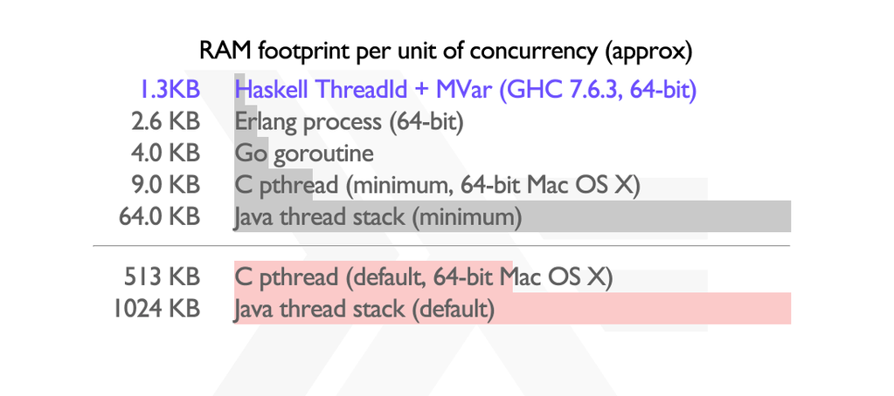

[Nice presentation](http://bob.ippoli.to/haskell-for-erlangers-2014/#/title)

---

Есть ядра нашего процессора, над ними идут OS-трэды, так называемые трэды операционной системы, которые непосредственно исполняются на ядрах.

Над ними у нас есть Haskell легковесные трэды, или green-трэды, которые также есть во многих других языках. Они не обязательно один в один мапятся к OS-трэдам. То есть на одном OS-трэде можно запускать много-много Haskell легковесных трэдов.

И самая мелкая, самая гранулярная единица – это так называемые спарки. О спарках мы будем говорить, когда будем говорить о параллелизме. Спарк представляет собой маленькую задачку из fork-drawing-pool Haskell, которую мы хотим запустить в отдельном потоке.

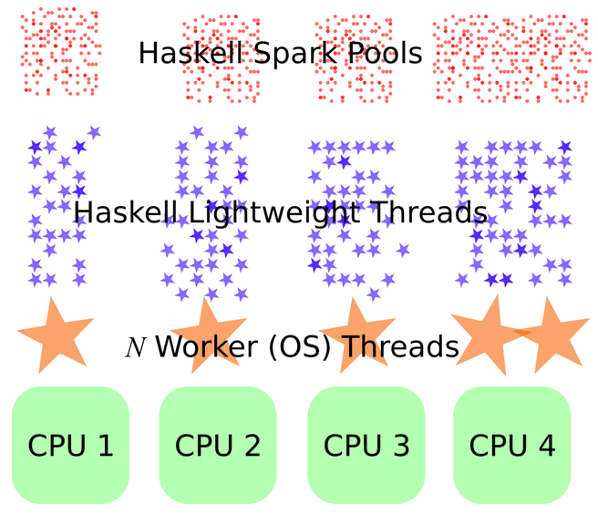

> То есть если трэдов в Haskell можно наспавнить достаточно много, потому что они не обязательно один в один мапятся к OS-трэдам, потому что они достаточно легковесные, то спарки – это куда более и более мелкая единица, которой вообще можно тысячами плодить и никаким образом от этого не страдать.

---

## Fork a thread

```haskell
forkIO :: IO () -> IO ThreadId  -- creates lightweight thread
```

```haskell
import Control.Concurrent

main = do
  _threadId <- forkIO $ do
    threadDelay 1000000
    putStrLn "Forked thread awake"
  threadDelay 2000000
  putStrLn "Main thread finishes"
```

```bash
ghc -threaded -o test Test.hs
./test +RTS -N2

Forked thread awake
Main thread finishes
```

- `-threaded` для компиляции многопоточки
- `+RTS` для линковки библиотеки многопоточки
- `-N2` количество потоков 2

По умолчанию многопоточность выключенна, но код будет работать. (будет запускаться в одном потоке по очереди, по маленьким кусочкам)

```bash
ghc -o test Test.hs && ./test

Forked thread awake
Main thread finishes
```

---

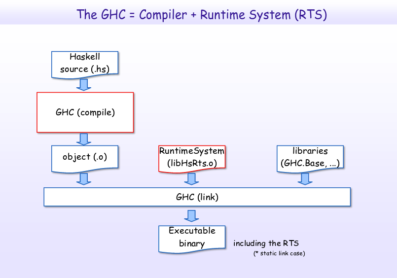

---

## Where is my join?

`MVar` - Mutex Variable

```haskell
data MVar a  -- empty or full box

newEmptyMVar :: IO (MVar a)           -- create empty box
putMVar      :: MVar a -> a -> IO ()  -- fill box with value
takeMVar     :: MVar a -> IO a        -- take var with block
```

Пример:

```haskell
import Control.Concurrent

main = do
  tm1 <- newEmptyMVar
  tm2 <- newEmptyMVar
  _threadId1 <- forkIO $ do
    threadDelay 1000000
    putMVar tm1 100500
  _threadId2 <- forkIO $ do
    threadDelay 1000000
    putMVar tm2 "This is horosho"

  r1 <- takeMVar tm1
  r2 <- takeMVar tm2

  putStrLn $ "r1: " <> show r1 <> ", r2: " <> show r2
```

`takeMVar` ожидает пока изменится значение

---

## More about MVar

MVar is basically a value guarded by mutex lock.

And runtime system is able to detect some deadlock cases.

```haskell
-- MVTest.hs

main = do
    m <- newEmptyMVar
    takeMVar m
```

```haskell
-- throws BlockedIndefinitelyOnMVar exception
MVTest: thread blocked indefinitely in an MVar operation
```

```haskell
-- all exceptions
BlockedIndefinitelyOnMVar
BlockedIndefinitelyOnSTM
NonTermination
Deadlock
```

---

## What to do thread id?

Stop (interrupt) a thread :)

- Послать исключение в поток по id (`throwTo`)
- `killThread` обертка над `throwTo`

```haskell
throwTo :: Exception e => ThreadId -> e -> IO ()

killThread :: ThreadId -> IO ()
killThread tid = throwTo tid ThreadKilled
```

Асинхронное исключение: (когда один поток отсылает "данные" в другой)

```haskell
main = do
  tid <- forkIO myHeavyComputation
  threadDelay 1000000 -- 1 sec timeout for completion
  killThread tid
```

How to handle ^C from user? It's an than exception to main thread ;)

Как сделать прерывание программы от пользователя:

```haskell
main =
  handle intrHandler $
  flip mapM_ [1..1000] $ \i -> do
    threadDelay 1000000
    putStrLn $ "Finished round " <> show i

intrHandler :: AsyncException -> IO ()
intrHandler UserInterrupt = putStrLn "Finishing due to user interrupt ..."
intrHandler e = putStrLn $ "Caught async exception: " <> show e
```

---

## Exceptions classification

Synchronous exceptions

```haskell
throwIO :: Exception e => e -> IO a
throw :: Exception e => e -> a
```

```haskell
instance  Integral Int where
  a `div` b
     | b == 0 = throw DivideByZero
     | otherwise = ...
```

```haskell
foreign import ccall safe "HsBase.h __hscore_open"
   c_safe_open :: CFilePath -> CInt -> CMode -> IO CInt

openFile file flags mode = do
  res <- c_safe_open file flags mode
  when (res == -1) $ do
    errno <- getErrNo
    throwIO (toIOError errno file)
```

Asynchronous exceptions

```haskell
throwTo :: Exception e => ThreadId -> e -> IO ()
```

---

> Важная ремарка, что с точки зрения рантайм-системы хаскаля, эксепшены синхронные и эксепшены асинхронные оба представлены type-классом exception. То есть нет никакого различия для рантайма хаскаля, является ли данный эксепшен синхронным или асинхронным. Различие между этими эксепшенами сугубо семантическое по происхождению исключения. Произошло ли оно в том же потоке, то есть является ли оно асинхронным или асинхронным.

---

> В Haskell асинхронное исключение может прилететь в любой момент. То есть он может прервать какую-то операцию, если она не атомарна. Когда мы пишем concurrent код в Haskell, мы должны держать в голове всегда, что во время любой нашей операции нам может прилететь асинхронное исключение, которое нам по-хорошему бы обработать в терминах очистки ресурсов.

---

## Handle exception

Exception handling is uniform

```haskell
catch :: Exception e => IO a -> (e -> IO a) -> IO a

handle :: Exception e => (e -> IO a) -> IO a -> IO a
handle = flip catch
```

```haskell
data MyException = MyException   deriving Show
instance Exception MyException

main = do
  throwIO MyException
    `catch` \MyException -> putStrLn "Caught my IO exception"
  when (1 `div` 0 > 0) (putStrLn "not to happen")
    `catch` \e -> putStrLn $ "Caught " <> show (e :: ArithException)
  tid <- forkIO $
    (threadDelay 1000000 >> putStrLn "Done")
      `catch` \MyException -> putStrLn "Caught my async exception"
  threadDelay 500000
  throwTo tid MyException
```

```haskell
Caught my IO exception
Caught arith exception: divide by zero
Caught my async exception
```

> Как поймать любой Exception?
>
> У нас есть такой data type,
который называется someException. Это коробочка, которая умеет содержать внутри себя любое произвольное исключение. И у нас в type классе exception существуют функции fromException и toException. И с помощью функции fromException можно привести someException, то есть какое-то произвольное исключение, мы пока не знаем, какое. То есть какое-то наше исключение,которое лежит в коробочке. Мы с помощью функции fromException можем попытаться скастить это произвольное исключение к нашему. Можно с помощью функции fromException попытаться привести someException к myException. Функция fromException разрешает maybe. То есть либо нам удалось распаковать someException, и там лежит то, что нам нужно, либо там лежит что-то другое. В данном случае нам вернется nothing.
>
> Таким образом, если мы хотим в нашей функции поймать произвольное исключение, но каким-либо конкретным образом обработать, допустим, fileNotFound и divideByZero, условно говоря, мы ловим someException, пытаемся достать из него arithException, то есть divideByZero. Если нам удалось, мы каким-либо образом в специфичном обрабатываем. Затем, если нам не удалось, мы пытаемся достать оттуда io-шный Exception про fileNotFound. Если нам удалось, мы каким-либо образом чистим ресурсы или делаем что-то еще. И в каком-то общем кейсе, если там лежит что-то, что нам неизвестно, какое-то произвольное исключение другое, которое нам не удалось достать, мы каким-то последним случаем это обрабатываем.
>
> В чем фундаментальная проблема?
>
> В том, что тип нашего хендлера, вот этот аргумент, он называется хендлер. То есть это обработчик с исключением. Он должен иметь какой-то конкретный тип. Мы здесь можем ловить только какой-то конкретный exception. Допустим, myException или ourException. Мы не можем тут поймать какой-то е, который exception. И вот для того, чтобы уметь поймать что-то произвольное, придумали такую вещь, как самException. В него runtimeHaskell умеет запаковывать исключение, которое мы бросили. Которое мы потом на стороне ловли можем распаковать.
>
> На самом деле довольно важный аспект. Если кто не помнит, я советую пересмотреть это дело, пересмотреть слайды в лекции про IO. Мы там довольно подробно на этом остановились. Сейчас это было просто в качестве напоминания.

---

## Masquerade

```haskell
main = action `catch` \e -> do
         printError e
         cleanup
```

Если асинхронное исключение может появиться в любом контексте.

Может ли оно появиться внутри обработчика catch?

> Да может, и это проблема, потому что получится бесконечная лесенка из вложенных catch в каждом из которых может произойти исключение

```haskell
main = action `catch` \e -> do
         printError e
         (cleanup `catch` \e -> ...)
```

Still not good :(

```haskell
mask_ :: IO a -> IO a
```

Выполняет вычисления IO с маскировкой асинхронных исключений.

Т.е. любой поток, который попытается поднять исключение в текущем потоке с помощью [throwTo](https://hackage.haskell.org/package/base-4.12.0.0/docs/Control-Exception.html#v:throwTo), будет заблокирован до тех пор, пока асинхронные исключения не будут снова сняты.

> Вообще надо было обернуть весь `do` блок в `mask_` тк пока выполняется `printError` может прилететь исключение

```haskell
main = action `catch` \e -> do
         printError e
         (mask_ cleanup)
```

> К сожалению, функция mask – это довольно опасная штука, если же во время действия этого, которое мы оборачиваем с помощью функции mask, наша программа внезапно зацикливается, то с ней ничего нельзя делать, кроме как кинуть ей SIGKILL.

---

## Bracket is your friend

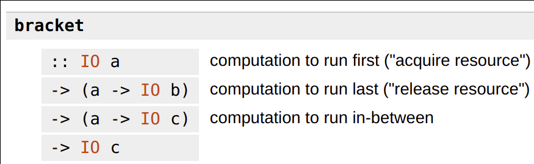
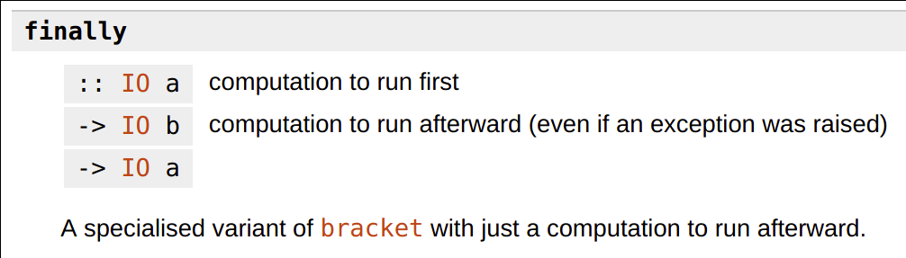

Несколько советов по обработке исключений

- Правильно использовать маску очень сложно, используйте *bracket*.
- Восстановление из асинхронных исключений опасно
  - Выполните очистку и выйдите из системы
- Асинхронные и синхронные исключения неотличимы друг от друга
  - Рассмотрите возможность использования пакета *safe-exceptions* (AsyncException).

[Must-read blog post on Exception handling!](https://www.fpcomplete.com/blog/2018/04/async-exception-handling-haskell)

---

## Never use forkIO

Давайте запустим два параллельных вычисления IO

```haskell
asyncExec :: IO a -> IO (MVar a)
asyncExec action = do
  mvar <- newEmptyMVar
  _tid <- forkIO (action >>= putMVar mvar)
  pure mvar

main = do
  resMV1 <- asyncExec $ do
    threadDelay 500000
    pure "foo"
  resMV2 <- asyncExec $ do
    threadDelay 500000
    pure "bar"
  (res1, res2) <- liftA2 (,) (takeMVar resMV1) (takeMVar resMV2)
  putStrLn $ "Computed " <> res1 <> " and " <> res2
```

```haskell
asyncExec :: IO a -> IO (MVar a)
asyncExec action = do
  mvar <- newEmptyMVar
  _tid <- forkIO (action >>= putMVar mvar)
  pure mvar

main = do
  resMV1 <- asyncExec $ do
    threadDelay 500000
    pure "foo"
  resMV2 <- asyncExec $ do
    threadDelay 500000
    throwIO MyException     -- < -- 
    pure "bar"
  (res1, res2) <- liftA2 (,) (takeMVar resMV1) (takeMVar resMV2)
  putStrLn $ "Computed " <> res1 <> " and " <> res2
```

Oops...

```haskell
MyException
*** Exception: thread blocked indefinitely in an MVar operation
```

> Если в начальном потоке что-то бросим, то основное, похоже, никогда не дождется. Да, все верно. Потому что представьте, что во время нашего экшена, допустим, мы бросим myException во втором потоке. Таким образом, мы в нашей функции asyncExec, когда запустим действие forClose, наш поток, в котором исполняется вот это действие, просто умрет, и мы никогда не дождемся того, что putMvar отработает. Таким образом, мы вернем пустой mvar. То есть функция asyncExec вернет пустой mvar для второго действия. Соответственно, данный mvar будет пустой, и мы бесконечно заблочимся.

---

```haskell
asyncExec :: IO a -> IO (MVar a)
asyncExec action = do
  mvar <- newEmptyMVar
  _tid <- forkIO (action >>= putMVar mvar)
  pure mvar

main = do
  let action1 = do
    threadDelay 500000
    pure "foo"
  let action2 = do
    threadDelay 500000
    throwIO MyException
    pure "bar"
  (res1, res2) <- concurrently action1 action2
  putStrLn $ "Computed " <> res1 <> " and " <> res2

concurrently :: IO a -> IO b -> IO (a, b)
```

Всё нормально:

```haskell
*** Exception: MyException
```

---

## Async package - Basic primitives

```haskell
-- Control.Concurrent.Async

concurrently :: IO a -> IO b -> IO (a, b)
race         :: IO a -> IO b -> IO (Either a b)
```

`concurrently` запускает параллельно, возвращает пару
`race` запускает параллельн, возвращает первое которое завершилось

```haskell
worker :: Int -> IO Int  -- simulate some work
worker n = threadDelay (10^2 * n) >> return (n * n)
```

```haskell
-- Spawn 2 threads in parallel, halt on both finished.
test1 :: IO (Int, Int)
test1 = concurrently (worker 1000) (worker 2000)
```

```haskell
-- Spawn 2 threads in parallel, halt on first finished.
test2 :: IO (Either Int Int)
test2 = race (worker 1000) (worker 2000)
```

```haskell
-- Spawn 10000 threads in parallel, halt on all finished.
test3 :: IO [Int]
test3 = mapConcurrently worker [0..10000]
```

`mapConcurrently` запускает список действий, использует грин треды, можно запускать сотнями и тысячими, но лучше не плодить

---

## Concurrently newtype

Concurrently – это просто обертка над иошным действием, который может быть скомпозирован с другими экземплярами типа concurrently, с использованием инстансов этой класса, аппликатив и альтернатив.

```haskell
-- Concurrently newtype is just an IO action that can be composed
-- with other Concurrently values using the Applicative and Alternative instances
newtype Concurrently a = Concurrently { runConcurrently :: IO a }
```

```haskell
test1 :: IO (Int, Int)
test1 = runConcurrently $ (,)
  <$> Concurrently (worker 1000)
  <*> Concurrently (worker 2000)
```

test1 - это просто `concurrently (worker 1000) (worker 2000)`

```haskell
test2 :: IO (Either Int Int)
test2 = runConcurrently
    $ (Left  <$> (Concurrently $ worker 1000))
  <|> (Right <$> (Concurrently $ worker 2000))
```

test2 - это просто `race(worker 1000) (worker 2000)`

> It's easy to build complex computation using Concurrently newtype

---

## Async package - Advanced usage

```haskell
-- The action running in a different thread, which, if successful,
-- will give a result of type 'a'.
data Async a
```

Если нужно внимательно следить за состоянием асинхронном вычисления запущенном в отдельном потоке

```haskell
withAsync :: IO a -> (Async a -> IO b) -> IO b
wait      :: Async a -> IO a  -- wait for an asynchronous action to be complete
cancel    :: Async a -> IO () -- cancel an asynchronous action
poll      :: Async a -> IO (Maybe (Either SomeException a)) -- check whether the action is completed
```

```haskell
test4 :: String -> String -> (ByteString, ByteString)
test4 url1 url2 = 
    withAsync (getURL url1) $ \a1 -> do
      withAsync (getURL url2) $ \a2 -> do
          page1 <- wait a1
          page2 <- wait a2
          pure (page1, page2)
```

---

## Transactions (1/3)

```haskell
type Account = IORef Integer

transfer :: Integer -> Account -> Account -> IO ()
transfer amount from to = do
    fromVal <- readIORef from
    toVal   <- readIORef to
    writeIORef from (fromVal - amount)
    writeIORef to (toVal + amount)
```

> You all know this is bad :)
>
> Плохо, что IORef не потокобезопасный

---

## Transactions (2/3)

```haskell
type Account = MVar Integer

credit :: Integer -> Account -> IO ()
credit amount account = do
    current <- takeMVar account
    putMVar account (current + amount)

debit :: Integer -> Account -> IO ()
debit amount account = do
    current <- takeMVar account
    putMVar account (current - amount)

transfer :: Integer -> Account -> Account -> IO ()
transfer amount from to = do
    debit amount from
    credit amount to
```

> Problems?
>
> Плохо, может быть deadlock если одновременно сделать a -> b и b -> a. Или мы можем выполнить какую-то операцию между debit/credit нашей текущей.

---

## Transactions (3/3)

```haskell
type Account = TVar Integer

credit :: Integer -> Account -> STM ()
credit amount account = do
    current <- readTVar account
    writeTVar account (current + amount)

debit :: Integer -> Account -> STM ()
debit amount account = do
    current <- readTVar account
    writeTVar account (current - amount)

transfer :: Integer -> Account -> Account -> STM ()
transfer amount from to = do
    debit amount from
    credit amount to
```

> STM выполянется атомарно, если за время выполнения изменятся данные - вычисление будет запущенно заново. При exception быдет rollback (запущенно заново).

---

## STM

> STM это код без блокировок

```haskell
-- import Control.Concurrent.STM
data STM a  -- software transactional memory
instance Monad STM where

atomically :: STM a -> IO a

data TVar a -- transactional variable
newTVar   :: a -> STM (TVar a)
readTVar  :: TVar a -> STM a
writeTVar :: TVar a -> a -> STM ()

retry     :: STM a                   -- try again current transaction
orElse    :: STM a -> STM a -> STM a -- if first retries then call second

throwSTM  :: Exception e => e -> STM a
catchSTM  :: Exception e => STM a -> (e -> STM a) -> STM a
```

> Executes all or rollback without applying changes.

---

## STM examples

```haskell
transfer :: Integer -> Account -> Account -> STM ()
transfer amount from to = do
    fromVal <- readTVar from
    if (fromVal - amount) >= 0
        then do
               debit amount from
               credit amount to
        else retry

takeEitherTMVar :: TMVar a -> TMVar b -> STM (Either a b)
takeEitherTMVar ma mb =
    fmap Left  (takeTMVar ma)
      `orElse`
    fmap Right (takeTMVar mb)
```

`TMVar` - можно лочить и использовать в монаде STM

STM (TVar) is composable and more flexible but MVar is faster.

If you want concurrent Map or Set: <http://hackage.haskell.org/package/stm-containers>

---

## Преимущества неизменности

1. Легче отлаживать
2. Легче писать потокобезопасный код
3. Трудно прострелить себе ногу или даже взорвать голову

Не могу модифицировать\
⇒ Нет записей\
⇒ Никаких гонок данных\
⇒ Нет блокировок

---

## Преимущества чистоты

1. Отсутствие побочных эффектов
2. Произвольный порядок оценки
3. Опять же, проще писать потокобезопасный код

---

## Parallel primitives

How to execute pure computations in parallel?

> Eval специальная монада для исполнения параллельных вычислений

```haskell
data Eval a                  -- Eval is monad for parallel computation
instance Monad Eval where

runEval :: Eval a -> a  -- pull the result out of the monad

rpar :: a -> Eval a  -- suggest to parallel, create *spark* 
rseq :: a -> Eval a  -- wait for evaluation of argument (eval it to WHNF)
```

- `rpar` вычисли значение до слабой головной нормальной формы параллельно
- `rseq` вычисли значение до слабой головной нормальной формы последовательно

> **Spark** — amount of job that could be done\
> **Spark** — hint to compiler: «Do it in parallel»

---

## Difference between rpar and rseq (1/3)

```haskell
runEval $ do
    a <- rpar (f x)  -- assume that (f x) evaluates longer 
    b <- rpar (f y)
    return (a, b)
```

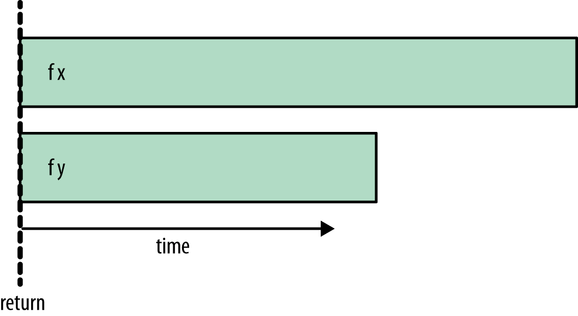

---

## Difference between rpar and rseq (2/3)

```haskell
runEval $ do
    a <- rpar (f x)  
    b <- rseq (f y)  -- change `rpar` to `rseq` here
    return (a, b)
```

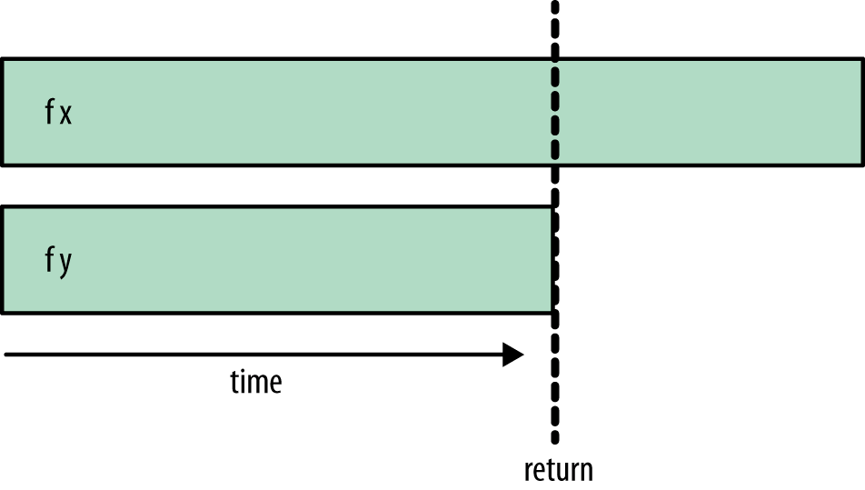

---

## Difference between rpar and rseq (3/3)

```haskell
runEval $ do
    a <- rpar (f x)
    b <- rseq (f y)
    rseq a
    return (a, b)
```

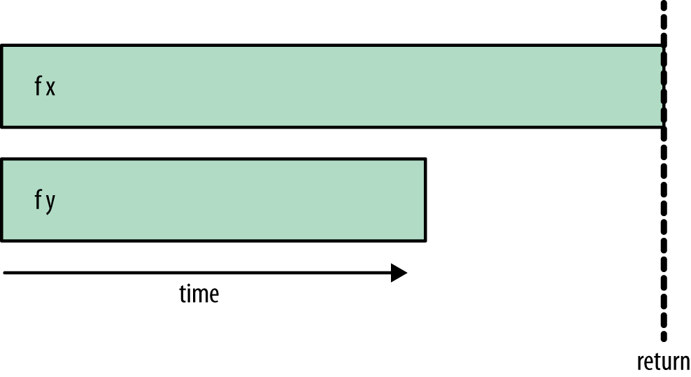

---

## Classic example: fib

```haskell
module Main where  -- TestFib.hs

fib :: Int -> Int  -- naive fibonacci
fib 0 = 1
fib 1 = 1
fib n = fib (n - 1) + fib (n - 2)

evalFibPair :: (Int, Int)
evalFibPair = (fib 39, fib 38)

main :: IO ()
main = print evalFibPair
```

bash:

```bash
ghc -O2 -rtsopts -eventlog TestFib.hs
./TestFib +RTS -s -l
```

- O2: optimization level
- rtsopts: add ability to use +RTS
- eventlog: add ability to produce log
- s: show stats in terminal
- l: generate .eventlog

---

## threadscope (1/3)

bash:

```bash
threadscope TestFib.eventlog
```

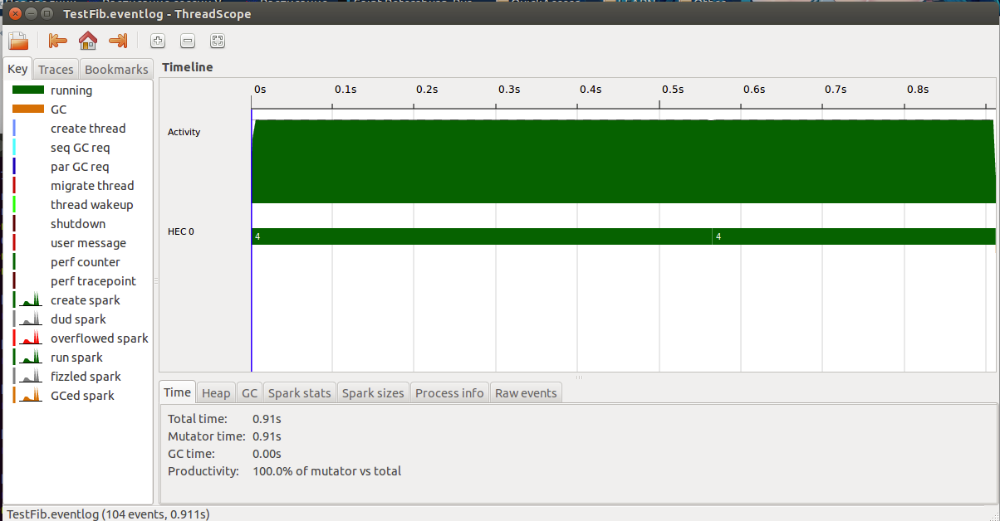

---

## threadscope (2/3)

```haskell
parEvalFibPair :: (Int, Int)
parEvalFibPair = runEval $ do
    a <- rpar (fib 39)
    b <- rpar (fib 38)
    return (a, b)
```

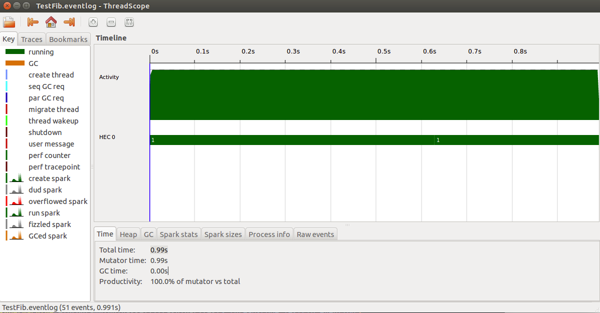

---

## More ghc options

> **No default multhreading**

bash:

```bash
ghc -O2 -threaded -rtsopts -eventlog TestFib.hs
./TestFib +RTS -N2 -s -l
```

- threaded: enable threading
- Ni: use i cores in CPU

---

## threadscope (3/3)

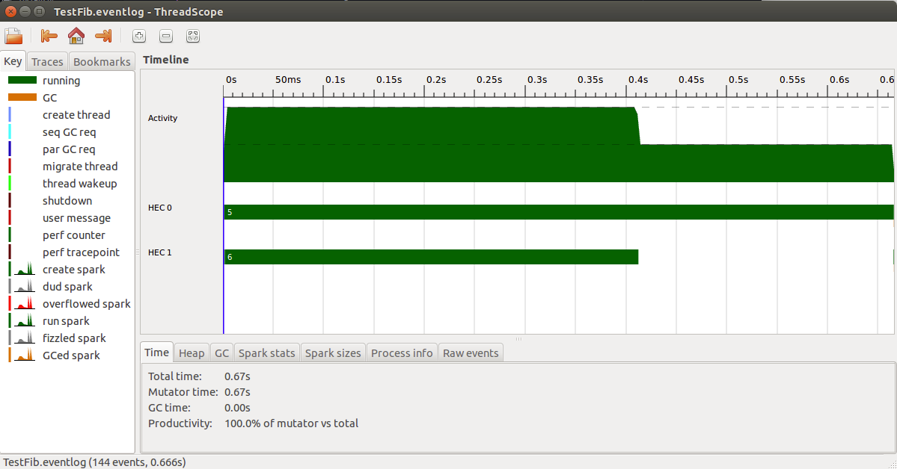

---

## What about sparks?

```cpp
  # some output produced by -s
  Parallel GC work balance: 46.74% (serial 0%, perfect 100%)

  TASKS: 6 (1 bound, 5 peak workers (5 total), using -N2)

  SPARKS: 2 (1 converted, 0 overflowed, 0 dud, 0 GC'd, 1 fizzled)

  INIT    time    0.003s  (  0.003s elapsed)
  MUT     time    1.365s  (  0.685s elapsed)
  GC      time    0.000s  (  0.000s elapsed)
  EXIT    time    0.001s  (  0.001s elapsed)
  Total   time    1.372s  (  0.689s elapsed)
```

> **converted** — useful work\
> **overflowed** — sparks generated after spark pool limit achieved\
> **dud** — already evaluated at the moment of applying `rpar`\
> **GC’d** — unused and thrown away (ignored) ⇒ garbage collected\
> **fizzled** — was unevaluated at the time it was sparked but was later evaluated independently by the program

---

> All is immutable and pure ⇒ lets parallelize all!
> **Problememes?**
> **No automatic parallelization :(**

---

## Innacurate parallelism (1/2)

```haskell
parFib :: Int -> Int
parFib 0 = 1
parFib 1 = 1
parFib n = runEval $ do
    a <- rpar $ parFib (n - 1)
    b <- rpar $ parFib (n - 2)
    pure (a + b)

main = print $ parFib 41
```

```haskell
  -- ./TestFib +RTS -N4 -s -l
  Parallel GC work balance: 55.53% (serial 0%, perfect 100%)

  TASKS: 10 (1 bound, 9 peak workers (9 total), using -N4)

  SPARKS: 535971258 (120 converted, 188823067 overflowed, 0 dud, 
                     346527789 GC'd, 620282 fizzled)

  INIT    time    0.001s  (  0.001s elapsed)
  MUT     time   24.200s  (  6.797s elapsed)
  GC      time    8.312s  (  2.321s elapsed)
  EXIT    time    0.001s  (  0.000s elapsed)
  Total   time   32.514s  (  9.119s elapsed)
```

---

## Innacurate parallelism (2/2)

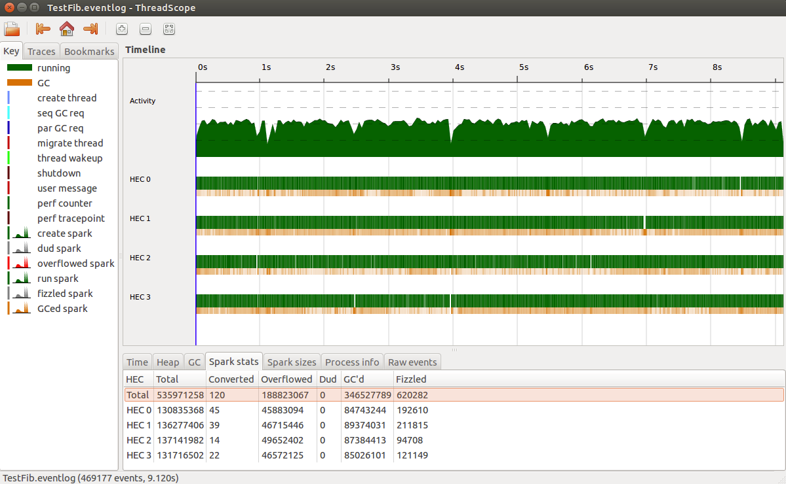

---

## What else?

1. REPA and DPH (parallel arrays, numerical haskell)
2. Channels (Chan and TChan)
3. Par monad
4. Distributed programming ([CloudHaskell](https://hackage.haskell.org/package/distributed-process))
5. GHC scheduler (round-robin)
6. Tuning and debugging

---

## Дополнительно, сверх лекции

---

## Read all concurrently

- [Real World Haskell (chapter 24): Concurrent and multicore progr.](http://book.realworldhaskell.org/read/concurrent-and-multicore-programming.html)
- [A tutorial on concurrent and parallel programming on haskell](http://research.microsoft.com/en-us/um/people/simonpj/papers/parallel/afp08-notes.pdf)
- [Parallel and concurrent programming in haskell (by Simon Marlow)](http://chimera.labs.oreilly.com/books/1230000000929)
- [Hackage: Control.Concurrent](https://hackage.haskell.org/package/base-4.8.1.0/docs/Control-Concurrent.html)
- [Hackage: Control.Parallel.Strategies](http://hackage.haskell.org/package/parallel-3.2.0.6/docs/Control-Parallel-Strategies.html)
- [Wiki: Concurrent Haskell (STM)](https://en.wikipedia.org/wiki/Concurrent_Haskell)
- [Hackage: Control.Concurrent.STM](http://hackage.haskell.org/package/stm-2.4.4/docs/Control-Concurrent-STM.html)
- [GHC/Data Parallel Haskell](https://wiki.haskell.org/GHC/Data_Parallel_Haskell)
- [Seq no more: Better Strategies for Parallel Haskell](http://community.haskell.org/~simonmar/papers/strategies.pdf)
- [ThreadScope Tour](https://wiki.haskell.org/ThreadScope_Tour)
- [A tutorial on Parallel Strategies in Haskell](http://www.cse.chalmers.se/edu/course/pfp/Papers/strategies-tutorial-v2.pdf)
- [RTS options cheatsheet](http://www.cheatography.com/nash/cheat-sheets/ghc-and-rts-options/)
- [Lightweight concurrency in GHC](https://ghc.haskell.org/trac/ghc/wiki/LightweightConcurrency)
- [Hackage: Control.Concurrent.Async](http://hackage.haskell.org/package/async-2.0.2/docs/Control-Concurrent-Async.html)
- [STM: Beautiful Concurrency](https://www.fpcomplete.com/school/advanced-haskell/beautiful-concurrency)
- [GHC Compiler big picture (+RTS)](https://takenobu-hs.github.io/downloads/haskell_ghc_illustrated.pdf)

---

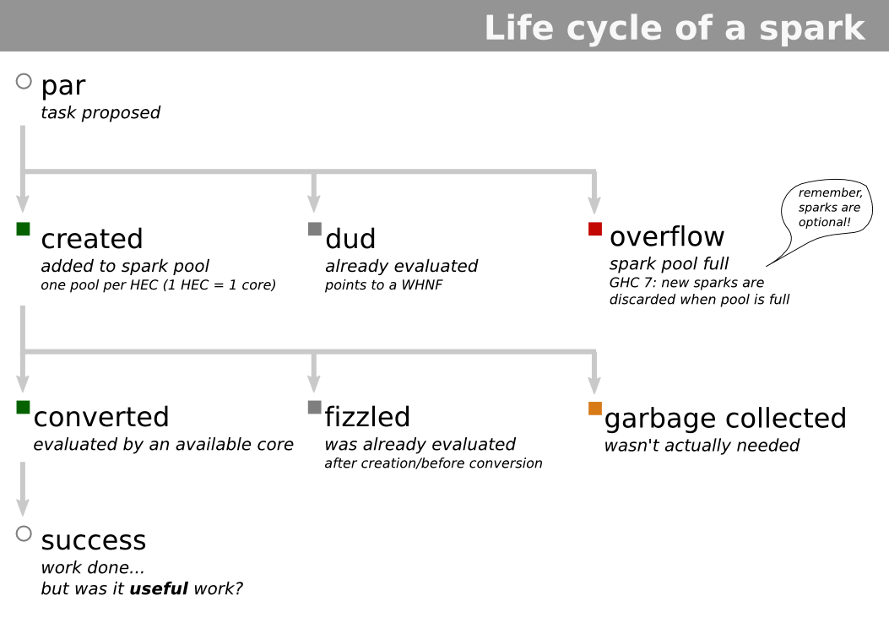

---

## Strategies

```haskell
rpar :: a -> Eval a
rseq :: a -> Eval a
```

> **Combine rpar and rseq?**

```haskell
type Strategy a = a -> Eval a
```

```haskell
parPair :: Strategy (a, b)  -- (a, b) -> Eval (a, b)
parPair (a, b) = do
    a' <- rpar a
    b' <- rpar b
    return (a', b')
```

```haskell
parPair :: Strategy (a, b)  -- or even better with applicative
parPair (a, b) = (,) <$> rpar a <*> rpar b
```

```haskell
parEvalFibPair :: (Int, Int)
parEvalFibPair = runEval $ parPair evalFibPair
```

```haskell
using :: a -> Strategy a -> a
x `using` s = runEval (s x)
```

```haskell
parEvalFibPair :: (Int, Int)
parEvalFibPair = evalFibPair `using` parPair  -- !!!
```

```haskell
withStrategy :: Strategy a -> a -> a  -- flipped `using`
```

---

## Combine strategies

```haskell
dot :: Strategy a -> Strategy a -> Strategy a
```

```haskell
strat2 `dot` strat1 = strat2 . runEval . strat1
```

```haskell
rparWith :: Strategy a -> Strategy a  -- behaves like: rpar `dot` strat
                                      -- just use: rparWith strat
```

```haskell
evalTuple2 :: Strategy a -> Strategy b -> Strategy (a, b)
evalTuple2 strat1 strat2 (x1, x2) = (,) <$> strat1 x1 <*> strat2 x2
```

```haskell
parTuple2 :: Strategy a -> Strategy b -> Strategy (a, b)
parTuple2 strat1 strat2 = evalTuple2 (rparWith strat1) (rparWith strat2)
```

```haskell
parPair :: Strategy (a, b)
parPair = evalTuple2 rpar rpar
```

```haskell
evalTraversable :: Traversable t => Strategy a -> Strategy (t a)
```

```haskell
evalTraversable = traverse
```

```haskell
parTraversable :: Traversable t => Strategy a -> Strategy (t a)
parTraversable strat = evalTraversable (rparWith strat)
```

```haskell
parList :: Strategy a -> Strategy [a]
```

```haskell
parMap :: Strategy b -> (a -> b) -> [a] -> [b]
```

```haskell
parMap strat f = withStrategy (parList strat) . map f
```

---

## parList and GC'd sparks (1/2)

```haskell
evalList :: Strategy a -> Strategy [a]
evalList strat []     = return []
evalList strat (x:xs) = do
  x'  <- strat x
  xs' <- evalList strat xs
  return (x':xs')
```

```haskell
parList :: Strategy a -> Strategy [a]
parList strat = evalList (rparWith strat)
```

> Let's write a tail-recursive version

```haskell
parList :: Strategy a -> Strategy [a]
parList strat xs = do
    go xs
    return xs
 where
  go []     = return ()
  go (x:xs) = do
      rparWith strat x
      go xs
```

---

## parList and GC'd sparks (2/2)

> **All the parallelism it creates will be discarded by the garbage collector**

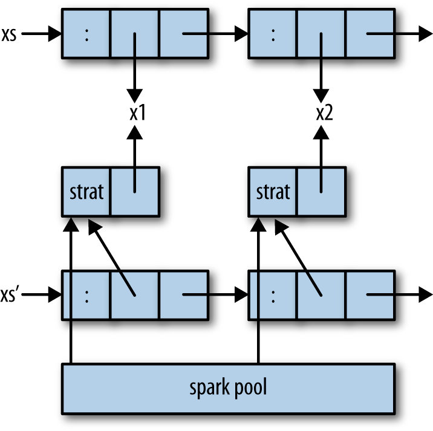

---

## Par Monad

```haskell
newtype Par a
instance Monad Par where

runPar :: Par a -> a
```

```haskell
fork :: Par () -> Par ()

data IVar a  -- instance Eq

new  :: Par (IVar a)
put  :: NFData a => IVar a -> a -> Par ()  -- evaluate to NF
put_ :: IVar a -> a -> Par ()              -- evaluate to WHNF
get  :: IVar a -> Par a
```

```haskell
parMTwoFibs :: Int -> Int -> Int
parMTwoFibs n m = runPar $ do
    i <- new
    j <- new
    fork (put i (fib n))
    fork (put j (fib m))
    a <- get i
    b <- get j
    return (a + b)
```

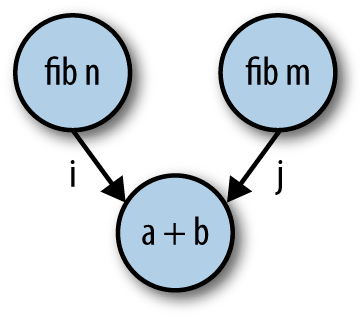

---

## Par examples (1/3)

```haskell
import Control.Monad (replicateM)
import Control.Monad.Par

f, g :: Int -> Int
f x = x + 10
g x = x * 10

example1 :: Int -> (Int, Int)
example1 x = runPar $ do
    [a,b,c,d,e] <- replicateM 5 new
    fork $ put a (f x)
    fork $ put b (g x)
    a' <- get a
    b' <- get b
    fork $ put c (a' + b')
    c' <- get c
    fork $ put d (f c')
    fork $ put e (g c')
    d' <- get d
    e' <- get e
    return (d', e')
```

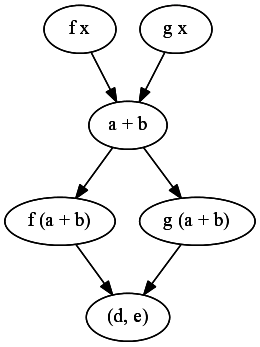

---

## Par maps

```haskell
spawn :: NFData a => Par a -> Par (IVar a)
spawn p = do
    i <- new
    fork $ p >>= put i
    return i
```

```haskell
-- monadic map
parMapM :: NFData b => (a -> Par b) -> [a] -> Par [b]
parMapM f xs = do
    ibs <- mapM (spawn . f) xs
    mapM get ibs
```

```haskell
-- simple parallel map
parMap :: NFData b => (a -> b) -> [a] -> Par [b]
```

## Par examples (2, 3 / 3)

```haskell
example2 :: [Int]
example2 = runPar $ parMap (+1) [1..25]
```

```haskell
-- foldr (+) 0 (map (^2) [1..n])
example3 :: Int -> Int
example3 n = runPar $ do
    let range       = InclusiveRange 1 n
    let mapper  x   = return (x^2)
    let reducer x y = return (x+y)
    parMapReduceRangeThresh 10 range mapper reducer 0
```
